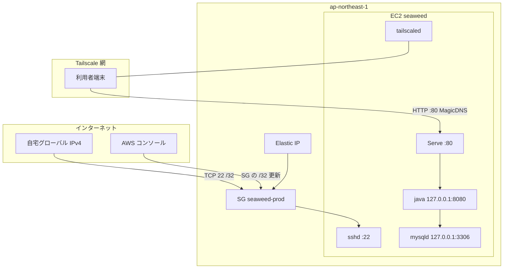

# seaweed インフラ設計書

No.9 ／ 版 1.0 ／ 2026-08-30 ／ 入力: 要件定義書 1.3、システム構成設計書 1.0、認証セキュリティ設計書 1.0

本番の **AWS 上の箱** を固定する。待受・URL・設定キーはシステム構成設計書。Cookie・ハッシュは認証セキュリティ設計書。systemd 全文・バックアップ手順・障害切り分けは運用設計書。

RDS、ALB、NAT Gateway、公開 DNS、Let's Encrypt、Nginx、オートスケールは採用しない。ネットワーク詳細設計書は作らない（本書類とシステム構成で足りる）。

## 目次

1. [方針](#1-方針)
2. [AWS 資源](#2-aws-資源)
3. [セキュリティグループ](#3-セキュリティグループ)
4. [OS とパッケージ](#4-os-とパッケージ)
5. [ディスクとメモリ](#5-ディスクとメモリ)
6. [SSH](#6-ssh)
7. [Tailscale](#7-tailscale)
8. [MySQL](#8-mysql)
9. [アプリ配置](#9-アプリ配置)
10. [構築順](#10-構築順)
11. [ローカルとの関係](#11-ローカルとの関係)
12. [要件対応](#12-要件対応)
13. [明示的にやらないこと](#13-明示的にやらないこと)
14. [設計判断一覧](#14-設計判断一覧)

## 1. 方針



- 業務トラフィックは **Tailscale だけ**。パブリック 80/443/8080/3306 は開けない。
- SSH は **パブリック 22 + 送信元 /32**。Tailscale 障害時もコンソールから SG を直して入れる（NFR-SEC-06）。
- アプリは `127.0.0.1:8080`。Serve が tailnet の TCP 80 をそこに転送する。アプリに Tailscale IP を書かない。

## 2. AWS 資源

アカウントは利用者個人の AWS。Organization・別アカウントは作らない。

| 項目 | 値 |
| --- | --- |
| リージョン | `ap-northeast-1`（東京） |
| VPC | そのリージョンの **デフォルト VPC**。新規 VPC・サブネット・IGW は作らない |
| サブネット | デフォルト VPC のパブリックサブネット 1 つ（AZ は起動時の既定でよい。単一 AZ） |
| インスタンス名（タグ `Name`） | `seaweed` |
| インスタンスタイプ | **t4g.small**（2 vCPU / 2 GiB / arm64） |
| AMI | Amazon Linux 2023 の **arm64** 最新（`al2023-ami-*-kernel-*-arm64`）。AMI ID は凍結しない |
| 購入 | オンデマンド。Savings Plans / スポットは使わない |
| パブリック IP | **Elastic IP を 1 つ確保して関連付け**（停止→起動で SSH 先が変わらない） |
| IPv6 | 割り当てない。SG も IPv6 ルールを置かない |
| EBS | ルート 1 本のみ。gp3、**30 GiB**、暗号化オン（AWS 管理キー）。追加ボリュームなし |
| IAM インスタンスプロファイル | 付けない（S3 / SSM は使わない） |
| IMDSv2 | 必須。ホップ制限 2 |
| 詳細モニタリング | オフ（基本モニタリングのみ） |
| ALB / NLB / CloudFront / Route 53 / ACM | 作らない |
| RDS / ElastiCache / EFS | 作らない |
| NAT Gateway | 作らない（パブリックサブネット直置き） |

キーペア名は `seaweed`（リージョン内）。秘密鍵は Git に置かない。既存キーを流用してもよい。

OS ホスト名は `seaweed`（`hostnamectl set-hostname seaweed`）。Tailscale のマシン名と同じにする。

メモリが足りず OOM が続く場合は **t4g.medium** に上げる（本書類の他の決めは変えない）。初回は small。

## 3. セキュリティグループ

名前: `seaweed-prod`。説明: `seaweed SSH + Tailscale UDP`。このインスタンスにだけ付ける。

**インバウンド**（これ以外は作らない）:

| 優先 | プロトコル | ポート | ソース | 用途 |
| --- | --- | --- | --- | --- |
| 1 | TCP | 22 | `HOME_IPV4/32` | SSH。0.0.0.0/0 は禁止 |
| 2 | UDP | 41641 | 0.0.0.0/0 | Tailscale 直接接続。無くても DERP で動く。開ける |

`HOME_IPV4` は構築時点の自宅グローバル IPv4。**本書類に実 IP を書かない。** SG のルール説明欄か、Git に入れない手元メモに置く。ISP 変動後は AWS コンソールで /32 を差し替える（OPS-RUN-06）。複数拠点なら /32 を並べる。

**禁止するインバウンド（誤作成したら削除）:**

- TCP 80, 443, 8080, 3306 の 0.0.0.0/0 および任意 CIDR
- TCP 22 の 0.0.0.0/0

**アウトバウンド:** IPv4 すべて許可（dnf、Tailscale コントロールプレーン、Amazon Time Sync）。細分化しない。

NACL はデフォルト VPC のまま。変更しない。

アプリは SG で 8080 を閉じていても、バインドが `127.0.0.1` なのでパブリック NIC には出ない。二重にする。

## 4. OS とパッケージ

| 項目 | 値 |
| --- | --- |
| OS | Amazon Linux 2023（arm64） |
| タイムゾーン | `Asia/Tokyo`（`timedatectl`） |
| ロケール | `C.UTF-8` でよい |
| 時刻同期 | 既定の chrony（Amazon Time Sync） |
| firewalld / nftables 追加ルール | **使わない。** 到達制御は SG + Tailscale + localhost バインド |
| SELinux | AL2023 の既定のまま。無効化しない |
| 本番に入れないもの | Node.js、nginx、httpd、Docker、git クローン用の秘密 |

入れるパッケージ:

| パッケージ | 用途 |
| --- | --- |
| `java-21-amazon-corretto-headless` | `/usr/bin/java`。GUI は入れない |
| MySQL 8.4 Community Server | Oracle 公式 yum リポジトリ（`mysql84-community`）。MariaDB は使わない |
| Tailscale | 公式 Amazon Linux 2023 リポジトリ（`pkgs.tailscale.com`） |

`java -version` が 21 であること。ディストリの `java-17` は使わない。

OS ユーザ:

| ユーザ | 用途 | シェル |
| --- | --- | --- |
| `ec2-user` | SSH。sudo | ログイン可 |
| `seaweed` | JAR 実行専用。`--system`、ホーム `/opt/seaweed` | `nologin` |
| `mysql` | パッケージ既定 | パッケージ既定 |

`seaweed` に SSH させない。sudo は `ec2-user` のみ。

自動更新: `dnf-automatic` は **入れない**（パッチ適用のタイミングを運用者が選ぶ。手順は運用設計書）。

## 5. ディスクとメモリ

ルート 30 GiB に全部載せる。データ用 EBS を分けない（スナップショット対象を 1 本にするため）。

| パス | 内容 |
| --- | --- |
| `/opt/seaweed/seaweed.jar` | 実行 JAR |
| `/etc/seaweed/seaweed.env` | 環境変数。640、`root:seaweed` |
| `/var/lib/mysql` | InnoDB データ（パッケージ既定） |
| `/var/log/mysqld.log` | MySQL ログ（パッケージ既定） |

スワップ: `/swapfile` 1 GiB（`t4g.small` の保険）。swappiness は既定でよい。

| プロセス | 上限 |
| --- | --- |
| JVM | `-Xms256m -Xmx512m`。`JAVA_TOOL_OPTIONS` に `-Duser.timezone=Asia/Tokyo` と一緒に入れる（ユニット全文は運用設計書） |
| MySQL | `innodb_buffer_pool_size=256M`。`max_connections=30` |

Hikari 最大 5（システム構成）と矛盾しない。

## 6. SSH

| 項目 | 値 |
| --- | --- |
| 待受 | `0.0.0.0:22`（パブリック EIP と Tailscale IP の両方）。ポート変更しない |
| 認証 | 公開鍵のみ。`PasswordAuthentication no`。`PermitRootLogin no` |
| ログインユーザ | `ec2-user` のみ（`AllowUsers ec2-user`） |
| 接続先 | Elastic IP。ホスト名の公開 DNS は使わない（独自ドメインなし） |
| Tailscale SSH（製品機能） | 使わない。OpenSSH だけ |

sshd は OS 起動と同時に enable。アプリが落ちていても SSH できること。

## 7. Tailscale

| 項目 | 値 |
| --- | --- |
| アカウント | 利用者個人の tailnet（無料枠で足りる。1 ユーザ + 端末数台 + 本 EC2） |
| ノード | EC2 と利用者端末のみ。Funnel は **有効にしない** |
| ホスト名 | `tailscale set --hostname=seaweed` |
| MagicDNS | tailnet 設定で **オン**。利用者 URL は `http://seaweed/`（システム構成） |
| HTTPS 証明書（`*.ts.net`） | **使わない。** Serve の既定 HTTPS（443）は使わない |
| サブネットルータ / exit node | 使わない |
| ACL | 個人 tailnet の既定（メンバ相互通信）でよい。本システム専用のタグ分けはしない |

インストール後:

```text
systemctl enable --now tailscaled
tailscale up
tailscale set --hostname=seaweed
```

`tailscale up` の認証キーはコンソール発行の使い捨て。Git と env に残さない。

Serve（再起動後も残る `--bg`。これが tailnet の :80 → 8080）:

```text
tailscale serve --bg --http=80 http://127.0.0.1:8080
```

確認: `tailscale serve status` がポート 80 の HTTP プロキシであること。443 / Funnel が出ていたら `tailscale serve reset` のうえ上記だけやり直す。

端末側: 同じ tailnet に参加し MagicDNS が効いていること。ブラウザは `http://seaweed/`。`https://` では開かない（証明書を出さない）。

UDP 41641 を SG で開けていれば直接 WireGuard、閉じていれば DERP。どちらでも業務は成立する。

## 8. MySQL

Amazon RDS は使わない。EC2 上の mysqld のみ。

| 項目 | 値 |
| --- | --- |
| 版 | **8.4 LTS**（Community）。8.0 系でも動くが新規は 8.4 |
| サービス名 | `mysqld`。`systemctl enable --now mysqld` |
| 待受 | `bind-address=127.0.0.1`。`mysqlx` を使うなら同様に localhost のみ。ポート 3306 を LAN / パブリックに出さない |
| ソケット | アプリは使わない（JDBC は TCP `127.0.0.1:3306`） |
| 文字セット | `utf8mb4` / `utf8mb4_0900_ai_ci`（テーブル定義書） |
| サーバ TZ | `default-time-zone='+09:00'` |
| データディレクトリ | パッケージ既定 `/var/lib/mysql` |

`/etc/my.cnf.d/seaweed.cnf`（例。パッケージの drop-in に置く）:

```ini
[mysqld]
bind-address=127.0.0.1
skip-name-resolve
character-set-server=utf8mb4
collation-server=utf8mb4_0900_ai_ci
default-time-zone='+09:00'
innodb_buffer_pool_size=256M
max_connections=30
```

DB とアプリユーザ（構築時に手で実行。パスワードは `seaweed.env` の `SPRING_DATASOURCE_PASSWORD` と同じ）:

```sql
CREATE DATABASE seaweed CHARACTER SET utf8mb4 COLLATE utf8mb4_0900_ai_ci;
CREATE USER 'seaweed'@'127.0.0.1' IDENTIFIED BY '<本番パスワード>';
GRANT ALL PRIVILEGES ON seaweed.* TO 'seaweed'@'127.0.0.1';
FLUSH PRIVILEGES;
```

`'seaweed'@'%'` は作らない。JDBC は TCP のため `'seaweed'@'localhost'`（ソケット）だけでは足りない。root はソケットのみ（パッケージ既定）。テーブルの CREATE はテーブル定義書の SQL を `ec2-user` がローカルから適用する。

`mysql_native_password` へのダウングレードはしない（8.4 既定の `caching_sha2_password`）。Connector/J は Boot 3.4 同梱で足りる。

## 9. アプリ配置

ビルドは **開発機** で行う（システム構成 5.1）。EC2 に Node / Maven を入れない。成果物 `seaweed.jar` を `scp` で `/opt/seaweed/` へ置く（手順の全文は運用設計書）。

| 項目 | 値 |
| --- | --- |
| ユニット | `seaweed.service`。User=`seaweed`。`After=mysqld.service` |
| 待受 | env の `SERVER_ADDRESS=127.0.0.1` `SERVER_PORT=8080` |
| プロファイル | `SPRING_PROFILES_ACTIVE=prod` |
| env | `/etc/seaweed/seaweed.env`。キー名はシステム構成 7 章。権限は認証セキュリティ 10 章 |

`seaweed` ユーザが読めるのは `/opt/seaweed` と env（640）とだけ。`/var/lib/mysql` は読めなくてよい。

## 10. 構築順

実装・初回構築はこの順で迷わないこと。秘密の値はここに書かない。

1. リージョン `ap-northeast-1`、キーペア、SG `seaweed-prod`（22 は構築作業中の自分の IP /32）、EIP。
2. AL2023 arm64、t4g.small、30 GiB gp3 暗号化、パブリックサブネット、EIP 関連付け、IMDSv2。
3. SSH で入り、ホスト名・TZ・swap・`seaweed` ユーザ・ディレクトリ。
4. Corretto 21、MySQL 8.4、`seaweed.cnf`、DB と `'seaweed'@'127.0.0.1'`、テーブル定義書の SQL。
5. Tailscale 公式リポジトリ、`tailscale up`、hostname、Serve `--http=80`。Funnel オフを確認。
6. `seaweed.env` と `seaweed.jar`、systemd enable。`curl -sS http://127.0.0.1:8080/api/v1/health` が 200。
7. 端末の Tailscale から `http://seaweed/` でログイン画面。パブリック EIP の :80 は接続できないことを確認する。
8. SG の 22 を自宅 /32 に直す（構築に使ったカフェ IP を残さない）。

## 11. ローカルとの関係

開発機はシステム構成 8 章（Vite 5173、Spring local、MySQL 3306）。本書類の EC2 / SG / Tailscale Serve は **本番だけ**。ローカルに Tailscale は必須にしない。

ローカル MySQL も 8.4（または 8.0 以上）+ utf8mb4。3306 を LAN に出さない。

## 12. 要件対応

| 要件 | 本書類での決め |
| --- | --- |
| NFR-INF-01 | EC2 1 台、`ap-northeast-1`、t4g.small |
| NFR-INF-02 | EC2 上 MySQL 8.4。RDS なし |
| NFR-INF-03 | ALB・NAT・マネージド DB なし |
| NFR-INF-04 | JAR と mysqld 同居 |
| NFR-INF-05 | EC2 と端末が同一 tailnet。Serve HTTP 80 |
| NFR-SEC-01 / FR-AUTH-01 | 80/443/8080/3306 を SG で開けない。アプリは localhost |
| NFR-SEC-04 / OUT-10 | 公開 TLS・独自ドメインなし |
| NFR-SEC-06 / OPS-RUN-06 | SSH 22 は HOME_IPV4/32。コンソールで更新 |
| OPS-DEP-04 | 127.0.0.1:8080。パブリック待受なし |
| OPS-BAK-01 | スナップショット対象はルート EBS 1 本。取得手順は運用設計書 |
| NFR-01 / NFR-05 | OS TZ JST、MySQL utf8mb4 と +09:00 |

## 13. 明示的にやらないこと

- RDS、ALB、ACM、Let's Encrypt、独自ドメイン、Route 53
- Nginx / Caddy、公開 80/443
- アプリ内許可 IP、WAF、GuardDuty 必須化、CloudWatch アラーム
- マルチ AZ、オートスケール、コンテナオーケストレーション
- 本番 Docker / docker-compose
- SSM Session Manager を SSH の代替にする（要件は SG 付き SSH）
- ネットワークセグメント図の別冊
- バックアップ cron の中身（運用設計書）

## 14. 設計判断一覧

| ID | 判断 | 理由 |
| --- | --- | --- |
| D-INF-01 | リージョン東京、デフォルト VPC、t4g.small arm64 | 個人・低コスト。Corretto 21 と MySQL 8.4 は aarch64 で足りる |
| D-INF-02 | ルート gp3 30 GiB のみ。データボリュームを分けない | スナップショット対象を 1 本にする |
| D-INF-03 | Elastic IP を付ける | 停止起動後も SSH 先が変わらない。関連付け中は通常無料 |
| D-INF-04 | SSH は公開 22 + /32。Tailscale SSH は使わない | Tailscale 障害でもコンソール経由で入れる（NFR-SEC-06） |
| D-INF-05 | SG インバウンドは 22 と UDP 41641 だけ | アプリポートを世界に出さない。41641 は直接接続用 |
| D-INF-06 | Serve は `--http=80`。HTTPS Serve と Funnel は禁止 | `http://seaweed/` と Cookie Secure=false に合わせる |
| D-INF-07 | MySQL 8.4、`bind-address=127.0.0.1`、ユーザは `'seaweed'@'127.0.0.1'` | JDBC が TCP のため。`%` は作らない |
| D-INF-08 | 本番に Node / ビルドツールを置かない | 成果 JAR をコピーするだけ。攻撃面を増やさない |
| D-INF-09 | IPv6 なし | SSH 用 /32 の管理を IPv4 だけにする |
| D-INF-10 | IAM ロールなし | S3 バックアップ等を本版で必須にしない |
