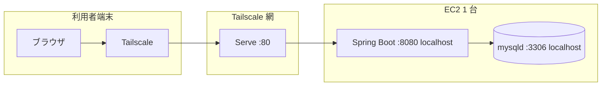

# seaweed システム構成設計書

No.1 ／ 版 1.1 ／ 2026-08-30 ／ 入力: 要件定義書 1.3 ／ 推敲: 後続 10 文書との整合

HTML 版: `docs/design/html/システム構成設計書.html`

## 目次

1. [文書の位置づけ](#1-文書の位置づけ)
2. [論理構成](#2-論理構成)
3. [実行トポロジと待受](#3-実行トポロジと待受)
4. [URL・パス規約](#4-urlパス規約)
5. [プロセス・ビルド・配置](#5-プロセスビルド配置)
6. [データストア接続](#6-データストア接続)
7. [設定キー](#7-設定キー)
8. [開発環境](#8-開発環境)
9. [後続文書への委譲](#9-後続文書への委譲)
10. [設計判断一覧](#10-設計判断一覧)

## 1. 文書の位置づけ

本書類は、実装および後続設計書（機能・画面・API・認証・インフラ等）が共通で使う**プロセス構成・待受・URL・設定キー**を固定する。要件の再掲はしない。

| 項目 | 値 |
| --- | --- |
| システム名 | seaweed |
| 利用者 | 1 名。ブラウザ（デスクトップ Chrome 相当）。モバイル専用 UI は作らない |
| 本番ホスト | AWS EC2 1 台。アプリ JAR と mysqld を同居。RDS・ALB・公開 DNS は使わない |
| 到達 | Tailscale 閉域のみ。インターネットに HTTP/HTTPS を出さない |

## 2. 論理構成

ブラウザは同一オリジンで SPA と JSON API の両方を使う。API サーバが静的ファイルも返す。リバースプロキシ（Nginx 等）は置かない。



| 層 | 採用 | 役割 |
| --- | --- | --- |
| UI | React 18 + TypeScript + Vite 6 | 画面。本番ではビルド成果物を JAR に同梱 |
| API / 配信 | Java 21 + Spring Boot 3.4 | REST、セッション、静的配信、SPA フォールバック |
| DB | MySQL 8.0 以上（本番は 8.4 系を推奨） | 永続化。文字セット utf8mb4。接続タイムゾーン Asia/Tokyo |

**設計判断:** UI は TypeScript とする。要件は React のみ指定。後の画面・API の型を揃えるため。

**設計判断:** 本番に Nginx を置かない。プロセスを JAR と mysqld の 2 つに限り、閉域到達は Tailscale Serve に任せる。

### 2.1 リポジトリ構成（実装時）

```
seaweed/
  frontend/          Vite + React + TypeScript
  backend/           Spring Boot（パッケージ com.seaweed）
  docs/              要件・設計（本ファイル含む）
```

ルートに本番用 docker-compose は置かない。ローカルの MySQL だけコンテナにしてよい（8 章）。

### 2.2 モジュール境界

| モジュール | 責務 | 詳細の行き先 |
| --- | --- | --- |
| frontend | 画面・クライアントルーティング・API 呼び出し | 画面設計書、API設計書 |
| backend web | 認証フィルタ、静的配信、API コントローラ | 認証セキュリティ設計書、API設計書 |
| backend domain | 家計・マスタ・予測計算 | 機能設計書、処理仕様書 |
| backend persistence | JPA / JDBC とテーブル対応 | テーブル定義書 |

パッケージは `com.seaweed.{web,auth,ledger,subscription,investment,income,balance,goal,dashboard}` を目安とする。機能設計書でエンドポイントと突合する。

## 3. 実行トポロジと待受

### 3.1 本番プロセス

| プロセス | ユーザ（OS） | 待受 | 管理 |
| --- | --- | --- | --- |
| java -jar seaweed.jar | `seaweed`（専用） | `127.0.0.1:8080` のみ | systemd ユニット `seaweed.service` |
| mysqld | ディストリの mysql ユーザ | `127.0.0.1:3306` のみ | ディストリの mysql サービス |
| tailscaled | root | オーバーレイ（インフラ設計書） | Tailscale 公式の unit |

**設計判断:** Spring Boot は `127.0.0.1` にバインドし、パブリック NIC では待受しない（OPS-DEP-04）。Tailscale 網からの入口は Serve が `80 → 127.0.0.1:8080` を転送する。アプリに Tailscale IP を書かない（IP 変動で起動できなくなるため）。

EC2 のセキュリティグループで **8080 と 3306 をインターネットへ開放しない**。SSH（22）の送信元制限はインフラ設計書。アプリポートの 0.0.0.0/0 開放は禁止。

### 3.2 利用者が開く URL

| 項目 | 値 |
| --- | --- |
| Tailscale マシン名 | `seaweed`（MagicDNS 有効） |
| 利用者向け URL | `http://seaweed/` |
| スキーム | HTTP。公開証明書・Let's Encrypt・ALB・独自ドメインは使わない |
| 閉域内 TLS | 使わない（Cookie の Secure を付けない前提。認証セキュリティ設計書） |

Serve の具体コマンドはインフラ設計書。本書類では「tailnet の TCP 80 が 127.0.0.1:8080 に届く」ことだけを契約とする。

### 3.3 同一オリジン

SPA と API はどちらも `http://seaweed`（ポート 80）から配信する。CORS は設定しない（同一オリジン）。開発時のみ Vite がプロキシする（8 章）。

## 4. URL・パス規約

コンテキストパスは空（`server.servlet.context-path=`）。

### 4.1 画面（SPA）

クライアントルータ（React Router）。サーバは `/api/**` 以外の GET で、実ファイルが無ければ `index.html` を返す。

| パス | 画面 |
| --- | --- |
| `/login` | ログイン |
| `/` | ダッシュボード |
| `/ledger` | 家計簿一覧・登録・編集 |
| `/subscriptions` | サブスク |
| `/investments` | 投資記録 |
| `/incomes` | 定期収入 |
| `/settings` | 手元資金・貯蓄目標（到達希望時期を含む） |

項目・遷移の詳細は画面設計書。ここを後続のパスの正とする。

### 4.2 API

| 項目 | 値 |
| --- | --- |
| プレフィックス | `/api/v1` |
| 形式 | JSON、`Content-Type: application/json; charset=UTF-8` |
| 日付 | 暦日は `YYYY-MM-DD`（JST の日付。時刻付きは API 設計書） |
| 金額 | JSON 数値（IEEE ではなく、文字列にしない）。サーバは DECIMAL で扱う |

リソースパス・ステータス・ボディは API設計書。本書類で固定する入口だけ次のとおり。

| メソッド | パス | 認証 | 用途 |
| --- | --- | --- | --- |
| GET | `/api/v1/health` | 不要 | プロセス生存。本文 `{"status":"ok"}`、常に 200 |
| POST | `/api/v1/auth/login` | 不要 | ログイン |
| POST | `/api/v1/auth/logout` | 必要 | ログアウト |
| GET | `/api/v1/auth/me` | 必要 | セッション確認 |
| （各種） | `/api/v1/*` 上記以外 | 必要 | 業務 API。未認証は 401 |

**設計判断:** `/health` は認証なし。秘密を含まず、EC2 上や閉域からの生存確認に使う。業務データは返さない。

### 4.3 静的ファイル

| パス | 内容 |
| --- | --- |
| `/` 配下の `assets/` 等 | Vite のハッシュ付き JS/CSS |
| `/index.html` | SPA シェル（直接開かずルータ経由） |

Spring のリソース解決順: (1) `classpath:/static` の実ファイル (2) `/api/**` はコントローラ (3) それ以外の GET は `index.html`。

## 5. プロセス・ビルド・配置

### 5.1 ビルド

1. `frontend` で `npm ci && npm run build` → `frontend/dist/`
2. `dist/` を `backend/src/main/resources/static/` へコピー（CI または Maven の frontend-plugin / antrun）
3. `backend` で `./mvnw -q -DskipTests package` → `backend/target/seaweed.jar`（実行可能 JAR）

成果 JAR 名は `seaweed.jar` で固定する（`spring-boot.finalName`）。

### 5.2 本番配置パス

| パス | 内容 | Git |
| --- | --- | --- |
| `/opt/seaweed/seaweed.jar` | 実行 JAR | 含めない（成果物） |
| `/etc/seaweed/seaweed.env` | 環境変数（7 章）。権限 640、`root:seaweed` | 含めない |
| `/etc/systemd/system/seaweed.service` | 起動ユニット | 雛形はリポジトリに置いてよい（秘密なし） |

```
# seaweed.service の要点（運用設計書で全文）
[Service]
User=seaweed
EnvironmentFile=/etc/seaweed/seaweed.env
WorkingDirectory=/opt/seaweed
ExecStart=/usr/bin/java -jar /opt/seaweed/seaweed.jar
# JVM タイムゾーン
Environment=JAVA_TOOL_OPTIONS=-Duser.timezone=Asia/Tokyo
```

### 5.3 Spring プロファイル

| 値 | 用途 |
| --- | --- |
| `local` | 開発。既定ポート 8080、詳細 8 章 |
| `prod` | 本番。待受 127.0.0.1:8080。秘密は環境変数のみ |

起動: `SPRING_PROFILES_ACTIVE=prod`。

## 6. データストア接続

| 項目 | 値 |
| --- | --- |
| ホスト | 127.0.0.1（ソケット接続にしない。実装を単純にするため） |
| ポート | 3306 |
| データベース名 | `seaweed` |
| アプリ接続ユーザ | `seaweed`（localhost のみ） |
| DDL | アプリの自動生成に頼らない。テーブル定義書の DDL を人が適用する |
| JDBC URL 形 | `jdbc:mysql://127.0.0.1:3306/seaweed?characterEncoding=UTF-8&connectionTimeZone=Asia/Tokyo` |
| プール | HikariCP（Boot 既定）。最大 5 接続で足りる |

**設計判断:** Flyway / Liquibase は v1 では入れない。変更はテーブル定義書と手適用の SQL。個人・期間短のため。

スキーマ・型・DECIMAL 桁はテーブル定義書。mysqld のインストール方法はインフラ設計書。

## 7. 設定キー

ソースに秘密を書かない。本番は `/etc/seaweed/seaweed.env`。Spring の relaxed binding で読める名前にする。

| 環境変数 | 必須 | 意味 |
| --- | --- | --- |
| `SPRING_PROFILES_ACTIVE` | 本番 Yes | `prod` |
| `SERVER_ADDRESS` | 本番 Yes | `127.0.0.1` |
| `SERVER_PORT` | 本番 Yes | `8080` |
| `SPRING_DATASOURCE_URL` | Yes | 6 章の JDBC URL |
| `SPRING_DATASOURCE_USERNAME` | Yes | `seaweed` |
| `SPRING_DATASOURCE_PASSWORD` | Yes | DB パスワード |
| `SEAWEED_AUTH_USERNAME` | Yes | ログイン ID（アカウント 1 件） |
| `SEAWEED_AUTH_PASSWORD_HASH` | Yes | パスワードハッシュ。アルゴリズムは認証セキュリティ設計書 |

ハッシュ方式・セッション Cookie 名・有効期間は認証セキュリティ設計書。本キー名は変えない。

`application-prod.yml` に書いてよいもの: ポート既定、Hikari 最大 5、Jackson のタイムゾーン `Asia/Tokyo`、ログは STDOUT（journald が収集）。パスワード類は YAML に書かない。

## 8. 開発環境

**設計判断:** ローカルでは Tailscale を必須にしない。ブラウザは `http://127.0.0.1:5173`、Vite が `/api` を `http://127.0.0.1:8080` へプロキシする。

| プロセス | 待受 |
| --- | --- |
| Vite `npm run dev` | `127.0.0.1:5173` |
| Spring `local` プロファイル | `127.0.0.1:8080` |
| MySQL | `127.0.0.1:3306`（ホスト直接、または開発用コンテナ。3306 を LAN に出さない） |

ローカルの `SEAWEED_AUTH_*` と DB パスワードは `backend/src/main/resources/application-local.yml` に置いてよいが、そのファイルは Git にコミットしない。コミットするのは `application-local.yml.example`（ダミー値）のみ。

本番制約（単一相当の JAR、RDS なし、許可 IP フィルタなし）をローカルで壊さない。公開用 TLS もローカルで導入しない。

## 9. 後続文書への委譲

| 文書 | 本書類で決めないこと |
| --- | --- |
| 機能設計書 | FR と画面・API・テーブルの対応、パッケージ詳細 |
| 画面設計書 | 項目、バリデーション文言、空状態 |
| API設計書 | 各リソースのパス、リクエスト／レスポンス、エラーコード |
| コード定義書 / テーブル定義書 | 区分値、列、DECIMAL 桁 |
| 処理仕様書 | 予測・内訳の計算手順 |
| 認証・セキュリティ設計書 | ハッシュ、セッション、Cookie、401（403 は使わない）、ログイン失敗の扱い |
| インフラ設計書 | インスタンスタイプ、OS、SG ルール、Tailscale 導入、mysqld インストール |
| 運用設計書 | systemd 全文、バックアップ、障害切り分け手順 |

帳票・外部 IF・バッチ・公開 TLS 設計書は作らない（成果物一覧 3 章）。

## 10. 設計判断一覧

| ID | 判断 | 理由 |
| --- | --- | --- |
| D-SYS-01 | SPA と API を同一 Spring Boot で配信 | オリジンを分けず CORS とプロキシを本番から消す |
| D-SYS-02 | 待受は 127.0.0.1:8080。入口は Tailscale Serve :80 | パブリック NIC にバインドしない。Tailscale IP の直書きを避ける |
| D-SYS-03 | 利用者 URL は `http://seaweed/` | MagicDNS。公開ドメイン不要 |
| D-SYS-04 | 画面パスと `/api/v1` を本書類で固定 | 画面・API 設計の衝突を防ぐ |
| D-SYS-05 | TypeScript + Java 21 + Spring Boot 3.4 | LTS と現行 Boot 3 系 |
| D-SYS-06 | スキーママイグレーションツールなし | 個人・短期。テーブル定義書を正にする |
| D-SYS-07 | ローカルは Vite 5173 + プロキシ。Tailscale 任意 | 日常の実装を閉域セットアップから切り離す |
| D-SYS-08 | 認証アカウントは環境変数 1 件。users 表は作らない | 要件どおりユーザ 1。認証セキュリティ D-SEC-09 で確定。覆さない |

---

No.2〜10 は `docs/design/md/` に揃っている。ポート・パス・設定キーは本書類を正とする。
