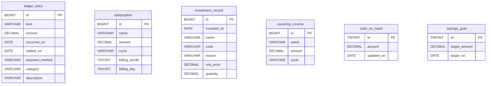

# seaweed テーブル定義書

No.6 ／ 版 1.0 ／ 2026-08-30 ／ 入力: 要件定義書 1.3、システム構成・機能・API・コード定義書

データベース名 `seaweed`（システム構成）。文字セット `utf8mb4`、照合 `utf8mb4_0900_ai_ci`、エンジン InnoDB。アプリの DDL 自動生成は使わない。本書類の SQL を手適用する。

## 目次

1. [共通規則](#1-共通規則)
2. [ER 概要](#2-er-概要)
3. [テーブル一覧](#3-テーブル一覧)
4. [ledger_entry](#4-ledger_entry)
5. [subscription](#5-subscription)
6. [investment_record](#6-investment_record)
7. [recurring_income](#7-recurring_income)
8. [cash_on_hand](#8-cash_on_hand)
9. [savings_goal](#9-savings_goal)
10. [初期データ](#10-初期データ)
11. [適用順 SQL](#11-適用順-sql)
12. [JPA 対応](#12-jpa-対応)
13. [設計判断一覧](#13-設計判断一覧)

## 1. 共通規則

| 項目 | 決め |
| --- | --- |
| PK | 業務行は `id BIGINT UNSIGNED NOT NULL AUTO_INCREMENT`。singleton は `id TINYINT UNSIGNED` 固定 1 |
| 論理削除 | しない。DELETE は行を消す |
| 利用者列 | `user_id` なし |
| 認証 | ユーザ表・パスワード列なし |
| コード列 | VARCHAR。コード定義書の長さ。マスタ表なし |
| 金額 | `DECIMAL(15,2)`。円。0 不可の列は CHECK またはアプリ（4 章以降） |
| 単価 | `DECIMAL(15,4)` |
| 数量 | `DECIMAL(18,6)` |
| 投入額・月額換算 | **列に持たない。** API が計算する |
| 日付 | `DATE`。タイムゾーンはセッション `Asia/Tokyo`（JDBC 設定済み） |
| 監査列 | `created_at` 等は置かない |
| FK | テーブル間に外部キーなし（資源は独立） |
| CHECK | MySQL 8.0.16+。kind と category の組み合わせはアプリ（API）で検証 |

## 2. ER 概要

関連は無い。ダッシュボードは複数表を読むだけ。



## 3. テーブル一覧

| 物理名 | 件数 | API 資源 |
| --- | --- | --- |
| ledger_entry | 0..N | `/ledger-entries` |
| subscription | 0..N | `/subscriptions` |
| investment_record | 0..N | `/investments` |
| recurring_income | 0..N | `/incomes` |
| cash_on_hand | 1 | `/settings/balance` |
| savings_goal | 1 | `/settings/goal` |

セッションは DB に持たない（認証セキュリティ設計書）。

## 4. ledger_entry

家計簿 1 行。

| 列 | 型 | NULL | 制約 | API |
| --- | --- | --- | --- | --- |
| id | BIGINT UNSIGNED | NO | PK, AUTO_INCREMENT | id |
| kind | VARCHAR(16) | NO | CHECK IN ('expense','income') | kind |
| amount | DECIMAL(15,2) | NO | CHECK (amount > 0) | amount |
| occurred_on | DATE | NO | | occurredOn |
| settled_on | DATE | NO | | settledOn |
| payment_method | VARCHAR(16) | NO | | paymentMethod |
| category | VARCHAR(32) | NO | | category |
| description | VARCHAR(200) | NO | | description |

索引:

| 名前 | 列 | 用途 |
| --- | --- | --- |
| PRIMARY | id | |
| idx_ledger_settled | settled_on | dateField=settled |
| idx_ledger_occurred | occurred_on | dateField=occurred |

`credit_card` 時の settled_on 必須はアプリ。発生日と決済日の前後は制約しない。

## 5. subscription

| 列 | 型 | NULL | 制約 | API |
| --- | --- | --- | --- | --- |
| id | BIGINT UNSIGNED | NO | PK, AUTO_INCREMENT | id |
| name | VARCHAR(100) | NO | | name |
| amount | DECIMAL(15,2) | NO | CHECK (amount > 0) | amount |
| cycle | VARCHAR(16) | NO | CHECK IN ('monthly','yearly') | cycle |
| billing_month | TINYINT UNSIGNED | YES | NULL または 1〜12 | billingMonth |
| billing_day | TINYINT UNSIGNED | NO | 1〜28 | billingDay |

索引: `idx_subscription_name (name)`（一覧の名称順）。

アプリ: `cycle='monthly'` なら `billing_month IS NULL`。`yearly` なら `billing_month` NOT NULL。

## 6. investment_record

| 列 | 型 | NULL | 制約 | API |
| --- | --- | --- | --- | --- |
| id | BIGINT UNSIGNED | NO | PK, AUTO_INCREMENT | id |
| invested_on | DATE | NO | | investedOn |
| name | VARCHAR(100) | NO | | name |
| code | VARCHAR(20) | YES | | code（空は NULL） |
| reason | VARCHAR(500) | NO | | reason |
| unit_price | DECIMAL(15,4) | NO | CHECK (unit_price > 0) | unitPrice |
| quantity | DECIMAL(18,6) | NO | CHECK (quantity > 0) | quantity |

索引: `idx_investment_on (invested_on)`。

`invested_amount` 列は作らない。

## 7. recurring_income

| 列 | 型 | NULL | 制約 | API |
| --- | --- | --- | --- | --- |
| id | BIGINT UNSIGNED | NO | PK, AUTO_INCREMENT | id |
| name | VARCHAR(100) | NO | | name |
| amount | DECIMAL(15,2) | NO | CHECK (amount > 0) | amount |
| cycle | VARCHAR(16) | NO | CHECK IN ('monthly','yearly') | cycle |

索引: `idx_income_name (name)`。

支払日列なし。

## 8. cash_on_hand

| 列 | 型 | NULL | 制約 | API |
| --- | --- | --- | --- | --- |
| id | TINYINT UNSIGNED | NO | PK。値は常に 1 | （パスのみ） |
| amount | DECIMAL(15,2) | NO | CHECK (amount >= 0) | amount |
| updated_on | DATE | YES | NULL = 未登録（API） | updatedOn |

AUTO_INCREMENT しない。DELETE 禁止（アプリが呼ばない。誤 DELETE 時は 10 章の INSERT を再実行）。

## 9. savings_goal

| 列 | 型 | NULL | 制約 | API |
| --- | --- | --- | --- | --- |
| id | TINYINT UNSIGNED | NO | PK。値は常に 1 | |
| target_amount | DECIMAL(15,2) | YES | NULL=未設定。非 NULL なら > 0 | targetAmount |
| target_on | DATE | YES | NULL=希望なし。非 NULL ならその月の 1 日 | targetOn |

`target_on` の日が 1 以外はアプリが 400。DB では DATE として持つ。

## 10. 初期データ

スキーマ作成直後に必ず入れる。アプリ起動時の自動 insert はしない。

```sql
INSERT INTO cash_on_hand (id, amount, updated_on) VALUES (1, 0.00, NULL);
INSERT INTO savings_goal (id, target_amount, target_on) VALUES (1, NULL, NULL);
```

`amount=0` かつ `updated_on IS NULL` を「利用者が一度も PUT していない」とみなす（処理仕様書・画面の未登録）。

## 11. 適用順 SQL

```sql
CREATE DATABASE IF NOT EXISTS seaweed
  CHARACTER SET utf8mb4
  COLLATE utf8mb4_0900_ai_ci;

USE seaweed;

CREATE TABLE ledger_entry (
  id BIGINT UNSIGNED NOT NULL AUTO_INCREMENT,
  kind VARCHAR(16) NOT NULL,
  amount DECIMAL(15,2) NOT NULL,
  occurred_on DATE NOT NULL,
  settled_on DATE NOT NULL,
  payment_method VARCHAR(16) NOT NULL,
  category VARCHAR(32) NOT NULL,
  description VARCHAR(200) NOT NULL,
  PRIMARY KEY (id),
  CONSTRAINT chk_ledger_kind CHECK (kind IN ('expense', 'income')),
  CONSTRAINT chk_ledger_amount CHECK (amount > 0),
  KEY idx_ledger_settled (settled_on),
  KEY idx_ledger_occurred (occurred_on)
) ENGINE=InnoDB;

CREATE TABLE subscription (
  id BIGINT UNSIGNED NOT NULL AUTO_INCREMENT,
  name VARCHAR(100) NOT NULL,
  amount DECIMAL(15,2) NOT NULL,
  cycle VARCHAR(16) NOT NULL,
  billing_month TINYINT UNSIGNED NULL,
  billing_day TINYINT UNSIGNED NOT NULL,
  PRIMARY KEY (id),
  CONSTRAINT chk_sub_amount CHECK (amount > 0),
  CONSTRAINT chk_sub_cycle CHECK (cycle IN ('monthly', 'yearly')),
  CONSTRAINT chk_sub_month CHECK (billing_month IS NULL OR (billing_month BETWEEN 1 AND 12)),
  CONSTRAINT chk_sub_day CHECK (billing_day BETWEEN 1 AND 28),
  KEY idx_subscription_name (name)
) ENGINE=InnoDB;

CREATE TABLE investment_record (
  id BIGINT UNSIGNED NOT NULL AUTO_INCREMENT,
  invested_on DATE NOT NULL,
  name VARCHAR(100) NOT NULL,
  code VARCHAR(20) NULL,
  reason VARCHAR(500) NOT NULL,
  unit_price DECIMAL(15,4) NOT NULL,
  quantity DECIMAL(18,6) NOT NULL,
  PRIMARY KEY (id),
  CONSTRAINT chk_inv_price CHECK (unit_price > 0),
  CONSTRAINT chk_inv_qty CHECK (quantity > 0),
  KEY idx_investment_on (invested_on)
) ENGINE=InnoDB;

CREATE TABLE recurring_income (
  id BIGINT UNSIGNED NOT NULL AUTO_INCREMENT,
  name VARCHAR(100) NOT NULL,
  amount DECIMAL(15,2) NOT NULL,
  cycle VARCHAR(16) NOT NULL,
  PRIMARY KEY (id),
  CONSTRAINT chk_inc_amount CHECK (amount > 0),
  CONSTRAINT chk_inc_cycle CHECK (cycle IN ('monthly', 'yearly')),
  KEY idx_income_name (name)
) ENGINE=InnoDB;

CREATE TABLE cash_on_hand (
  id TINYINT UNSIGNED NOT NULL,
  amount DECIMAL(15,2) NOT NULL,
  updated_on DATE NULL,
  PRIMARY KEY (id),
  CONSTRAINT chk_cash_id CHECK (id = 1),
  CONSTRAINT chk_cash_amount CHECK (amount >= 0)
) ENGINE=InnoDB;

CREATE TABLE savings_goal (
  id TINYINT UNSIGNED NOT NULL,
  target_amount DECIMAL(15,2) NULL,
  target_on DATE NULL,
  PRIMARY KEY (id),
  CONSTRAINT chk_goal_id CHECK (id = 1),
  CONSTRAINT chk_goal_amount CHECK (target_amount IS NULL OR target_amount > 0)
) ENGINE=InnoDB;

INSERT INTO cash_on_hand (id, amount, updated_on) VALUES (1, 0.00, NULL);
INSERT INTO savings_goal (id, target_amount, target_on) VALUES (1, NULL, NULL);
```

## 12. JPA 対応

| 項目 | 決め |
| --- | --- |
| 命名 | 物理名スネークケース。`spring.jpa.hibernate.naming.physical-strategy` が Implicit なら `@Column(name="settled_on")` を明示してよい |
| `ddl-auto` | `none`（validate は DDL 適用後に可） |
| 数値 | `BigDecimal`。`LocalDate` |
| singleton | エンティティ id は常に `1L` ではなく `1`（TINYINT） |

## 13. 設計判断一覧

| ID | 判断 | 理由 |
| --- | --- | --- |
| D-DB-01 | 計算列を持たない | 投入額・月額換算の不整合を避ける |
| D-DB-02 | コードマスタ表なし | コード定義書 D-CD-01 |
| D-DB-03 | 金額 DECIMAL(15,2)、数量 (18,6)、単価 (15,4) | 円の小数と投信口数。整数円前提の作り直しをしない |
| D-DB-04 | 監査列なし | API が返さない。個人・短期 |
| D-DB-05 | 家計は発生日・決済日の複合索引ではなく単列 2 本 | クエリは常に片方の日付 |
| D-DB-06 | singleton は CHECK (id=1) | 行増殖を DB でも止める |
| D-DB-07 | 費目×kind の CHECK は置かない | 列挙が長く、API が既に弾く |
