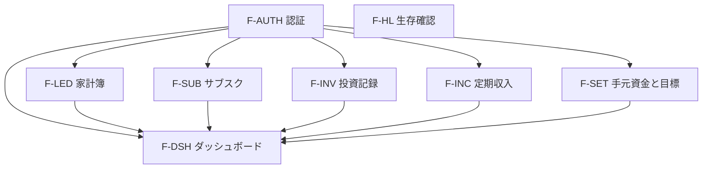

# seaweed 機能設計書

No.2 ／ 版 1.1 ／ 2026-08-30 ／ 入力: 要件定義書 1.3、システム構成設計書 1.1 ／ 推敲: 画面・認証との整合

パス・待受・`/api/v1` はシステム構成設計書に従う。本書類は **機能の分割と、画面・API・テーブルの担当** を固定する。

## 目次

1. [文書の位置づけ](#1-文書の位置づけ)
2. [機能分割](#2-機能分割)
3. [CRUD とダッシュボードの境界](#3-crud-とダッシュボードの境界)
4. [横断ルール](#4-横断ルール)
5. [機能別設計](#5-機能別設計)
6. [要件トレーサビリティ](#6-要件トレーサビリティ)
7. [パッケージと実装順](#7-パッケージと実装順)
8. [詳細の正（他文書）](#8-詳細の正他文書)
9. [設計判断一覧](#9-設計判断一覧)

## 1. 文書の位置づけ

| 層 | 本書類が決めること | 決めないこと |
| --- | --- | --- |
| 画面 | どの SPA パスがどの機能か | 項目・文言・空表示の詳細（画面設計書） |
| API | メソッドとパスの一覧、認証の要否 | ボディ・ステータスの詳細（API設計書） |
| 永続化 | 論理テーブル名と cardinality | 列・型・DECIMAL 桁（テーブル定義書） |
| 計算 | ダッシュボードは参照専用であること | 式・完了暦月の手順（処理仕様書） |
| 認証 | どの API がセッション必須か | ハッシュ・Cookie（認証セキュリティ設計書） |

閉域（Tailscale）と許可 IP を持たないことはアプリ機能ではない。FR-AUTH-01 / FR-AUTH-02 はインフラ・認証セキュリティへ委譲する。

## 2. 機能分割

利用者操作は次の 9 機能に分ける。バッチ・外部連携・帳票はない。

| ID | 機能 | 書き込み | 画面 | パッケージ |
| --- | --- | --- | --- | --- |
| F-AUTH | ログイン・ログアウト・セッション | なし（環境変数の 1 アカウント） | `/login` | `com.seaweed.auth` |
| F-LED | 家計簿 CRUD | `ledger_entry` | `/ledger` | `com.seaweed.ledger` |
| F-SUB | サブスク CRUD | `subscription` | `/subscriptions` | `com.seaweed.subscription` |
| F-INV | 投資記録 CRUD | `investment_record` | `/investments` | `com.seaweed.investment` |
| F-INC | 定期収入 CRUD | `recurring_income` | `/incomes` | `com.seaweed.income` |
| F-SET | 手元資金・貯蓄目標 | `cash_on_hand`（1 行）、`savings_goal`（1 行） | `/settings` | `com.seaweed.balance` / `com.seaweed.goal` |
| F-DSH | 現状・内訳・予測・逆算 | **なし** | `/` | `com.seaweed.dashboard` |
| F-HL | プロセス生存 | なし | なし | `com.seaweed.web` |

フロントは `frontend/src/pages` に画面パスと同名のページを置く（`LoginPage`, `DashboardPage`, `LedgerPage` 等）。共通レイアウト（ナビ・ログアウト）は `frontend/src/layout`。

## 3. CRUD とダッシュボードの境界

| ルール | 内容 |
| --- | --- |
| 書き込みの入口 | 家計簿・サブスク・投資・定期収入・手元資金・目標の画面と、対応する POST/PUT/DELETE のみ |
| ダッシュボード | `GET /api/v1/dashboard` のみ。INSERT/UPDATE/DELETE を発行しない |
| 自動仕訳 | サブスク・定期収入を家計簿へ複製しない（FR-SUB-06） |
| 予測の読み先 | 収入見込 = `recurring_income`、固定費 = `subscription`、変動費・確定の未来決済 = `ledger_entry`、起点 = `cash_on_hand`、目標 = `savings_goal` |
| 投資と現金 | `investment_record` は予測残高に足さない。現金の減少は利用者が `ledger_entry`（費目: 投資拠出）に書いたときだけ反映する |
| 時価 | 取得しない。外部 API を呼ばない |

ダッシュボードが返す数値の式は処理仕様書。本書類は「どのテーブルを読むか」だけを固定する。

## 4. 横断ルール

| 項目 | 決め |
| --- | --- |
| 識別子 | 業務行の PK は符号なし相当の整数（AUTO_INCREMENT）。API パスは `{id}` を十進整数とする |
| 削除 | 物理削除。削除済みフラグは持たない |
| 利用者スコープ | 全テーブルは単一利用者前提。`user_id` 列は持たない |
| 認証アカウント | テーブルにしない（システム構成 D-SYS-08）。`SEAWEED_AUTH_USERNAME` / `SEAWEED_AUTH_PASSWORD_HASH` |
| 一覧件数 | ページングなし。家計簿は期間必須。1 応答の上限 500 件。超過時は 400（期間を狭める） |
| サブスク・定期収入・投資 | 全件返す。上限 200 件。超過時は 400 |
| バリデーション失敗 | 400。存在しない id は 404。未認証は 401 |
| 成功 | 一覧・取得 200、作成 201、更新 200、削除 204 本文なし |
| 投入金額 | 投資はサーバが `単価 × 数量` を計算して返す。クライアントは投入金額を POST しない |
| 区分値 | 費目・支払手段・周期・収支区分のコードはコード定義書。アプリは固定 enum。マスタ編集 API は作らない |
| 発生日と資金決済日 | 家計簿のみ持つ。他マスタは持たない |
| FR-LED-10 | 資金決済日の初期値セットは **フロント**。サーバはクレジットカードかつ資金決済日欠落を 400 とする |

## 5. 機能別設計

### 5.1 F-AUTH 認証

| 項目 | 値 |
| --- | --- |
| 画面 | `/login`。業務画面のレイアウトにはログアウトを置く |
| ログイン成功後 | 画面設計書 1.2（`from` があればそこへ、なければ `/`） |
| 未認証で業務 SPA へ | `/login` へリダイレクト。クエリ `?from=` は画面設計書 1.2 |

| メソッド | パス | 認証 | 役割 |
| --- | --- | --- | --- |
| POST | `/api/v1/auth/login` | 不要 | セッション確立 |
| POST | `/api/v1/auth/logout` | 必要 | セッション破棄 |
| GET | `/api/v1/auth/me` | 必要 | ログイン中の表示名（ユーザー名） |

テーブルなし。セッション実装は認証セキュリティ設計書。FR-AUTH-07（パスワード変更 UI）は作らない。

### 5.2 F-HL 生存確認

| メソッド | パス | 認証 | 役割 |
| --- | --- | --- | --- |
| GET | `/api/v1/health` | 不要 | `{"status":"ok"}`、200 |

画面なし。DB 不通でも 200 でよい（プロセス生存が目的。詳細な依存確認は運用設計書）。

**設計判断:** health は DB を見ない。アプリ起動直後の切り分けを単純にするため。

### 5.3 F-LED 家計簿

| 項目 | 値 |
| --- | --- |
| 画面 | `/ledger`（一覧と登録・編集は同一パス。モーダルなし。画面設計書 D-UI-01） |
| テーブル | `ledger_entry`（0..N） |

| メソッド | パス | 認証 | 役割 |
| --- | --- | --- | --- |
| GET | `/api/v1/ledger-entries` | 必要 | 一覧。クエリ必須: `from`, `to`（`YYYY-MM-DD`）、`dateField=occurred\|settled`（発生日／資金決済日） |
| POST | `/api/v1/ledger-entries` | 必要 | 1 件登録 |
| GET | `/api/v1/ledger-entries/{id}` | 必要 | 1 件取得（編集初期表示） |
| PUT | `/api/v1/ledger-entries/{id}` | 必要 | 全項目更新 |
| DELETE | `/api/v1/ledger-entries/{id}` | 必要 | 物理削除 |

一覧の既定: 画面初期表示は当月・`dateField=settled`。サーバは既定を持たず、クエリ欠落は 400。

PATCH は使わない。部分更新しない。

### 5.4 F-SUB サブスク

| 項目 | 値 |
| --- | --- |
| 画面 | `/subscriptions` |
| テーブル | `subscription`（0..N） |

| メソッド | パス | 認証 | 役割 |
| --- | --- | --- | --- |
| GET | `/api/v1/subscriptions` | 必要 | 全件。並びは名称昇順 |
| POST | `/api/v1/subscriptions` | 必要 | 登録 |
| GET | `/api/v1/subscriptions/{id}` | 必要 | 1 件 |
| PUT | `/api/v1/subscriptions/{id}` | 必要 | 更新 |
| DELETE | `/api/v1/subscriptions/{id}` | 必要 | 物理削除 |

家計簿への自動作成はしない。支払日は保持するが、予測の月額換算には使わない（処理仕様書）。

### 5.5 F-INV 投資記録

| 項目 | 値 |
| --- | --- |
| 画面 | `/investments` |
| テーブル | `investment_record`（0..N） |

| メソッド | パス | 認証 | 役割 |
| --- | --- | --- | --- |
| GET | `/api/v1/investments` | 必要 | 全件。並びは投資日降順、同日は id 降順 |
| POST | `/api/v1/investments` | 必要 | 登録 |
| GET | `/api/v1/investments/{id}` | 必要 | 1 件 |
| PUT | `/api/v1/investments/{id}` | 必要 | 更新 |
| DELETE | `/api/v1/investments/{id}` | 必要 | 物理削除 |

同一銘柄の追加購入は行を分ける。平均取得単価 API は作らない。時価・売却 API は作らない。

### 5.6 F-INC 定期収入

| 項目 | 値 |
| --- | --- |
| 画面 | `/incomes` |
| テーブル | `recurring_income`（0..N） |

| メソッド | パス | 認証 | 役割 |
| --- | --- | --- | --- |
| GET | `/api/v1/incomes` | 必要 | 全件。名称昇順 |
| POST | `/api/v1/incomes` | 必要 | 登録 |
| GET | `/api/v1/incomes/{id}` | 必要 | 1 件 |
| PUT | `/api/v1/incomes/{id}` | 必要 | 更新 |
| DELETE | `/api/v1/incomes/{id}` | 必要 | 物理削除 |

家計簿の臨時収入とは別資源。給与を `ledger_entry` に書かせる API は提供しない（運用は画面の注意文。画面設計書）。

### 5.7 F-SET 手元資金と貯蓄目標

画面は `/settings` の 1 枚。API は資源を分ける（独立に保存できるようにする）。

| テーブル | cardinality | 初期 |
| --- | --- | --- |
| `cash_on_hand` | ちょうど 1 行（id=1） | DDL で金額 0、更新日時なし可 |
| `savings_goal` | ちょうど 1 行（id=1） | 目標額 NULL = 未設定、到達希望日 NULL = 未設定 |

| メソッド | パス | 認証 | 役割 |
| --- | --- | --- | --- |
| GET | `/api/v1/settings/balance` | 必要 | 手元資金 |
| PUT | `/api/v1/settings/balance` | 必要 | 全置換更新 |
| GET | `/api/v1/settings/goal` | 必要 | 目標額・到達希望日 |
| PUT | `/api/v1/settings/goal` | 必要 | 全置換。目標額を null で未設定に戻せる |

POST/DELETE は作らない。行の増減はさせない。

**設計判断:** 手元資金は家計の決済で自動増減しない。更新は本 PUT のみ。

### 5.8 F-DSH ダッシュボード

| 項目 | 値 |
| --- | --- |
| 画面 | `/` |
| テーブル | なし（他機能のテーブルを読む） |
| 書き込み | 禁止 |

| メソッド | パス | 認証 | 役割 |
| --- | --- | --- | --- |
| GET | `/api/v1/dashboard` | 必要 | 現状サマリ、費目別支出内訳、予測チャート系列、到達時期、逆算（条件付き）を **1 応答** で返す |

クエリ:

| 名前 | 必須 | 意味 |
| --- | --- | --- |
| `from` | 否。省略時は当月 1 日（サーバ JST） | 実績サマリ・内訳の開始（資金決済日） |
| `to` | 否。省略時は当月末（サーバ JST） | 実績サマリ・内訳の終了（資金決済日） |

`from` / `to` の片方だけ指定は 400。予測・到達・逆算は期間クエリに依存せず、処理仕様書の起点日（手元資金の最終更新日）で計算する。

応答に含めるブロック（キー名は API設計書で確定、欠けると実装が割れるため論理名だけ固定する）:

| ブロック | 読むもの | FR |
| --- | --- | --- |
| `balance` | `cash_on_hand` | FR-DSH-01 |
| `periodSummary` | 期間内 `ledger_entry` の収入合計・支出合計・差額 | FR-DSH-02 |
| `subscriptionMonthlyTotal` | `subscription` の月額換算合計 | FR-DSH-03 |
| `incomeMonthlyTotal` | `recurring_income` の月額換算合計 | FR-DSH-09 |
| `investmentSummary` | `investment_record` の件数と投入総額 | FR-DSH-04, FR-INV-07 |
| `expenseBreakdown` | 期間内支出の費目合計（0 円費目は載せない） | FR-DSH-10 |
| `forecast` | 月次貯金額、チャート点列（確定の未来決済を含む） | FR-DSH-05, FR-DSH-06 |
| `goalProjection` | 目標があるとき到達時期。希望時期があるときだけ逆算 | FR-DSH-07, FR-DSH-08 |

手元資金未登録相当（行はあるが利用者が一度も更新していない）の扱いは処理仕様書。チャートを出さない条件も同書。

内訳のグラフ種別（円／棒）は画面設計書。API は費目コードと金額の配列のみ。

## 6. 要件トレーサビリティ

| 要件 ID | 機能 | 画面 | API | テーブル |
| --- | --- | --- | --- | --- |
| FR-AUTH-01 | （非アプリ） | — | — | — |
| FR-AUTH-02 | 対象外 | — | 許可 IP ヘッダも見ない | — |
| FR-AUTH-03 | F-AUTH | `/login` | `POST /auth/login` | なし |
| FR-AUTH-04 | F-AUTH | — | セッション（認証セキュリティ） | なし |
| FR-AUTH-05 | F-AUTH | レイアウト | `POST /auth/logout` | なし |
| FR-AUTH-06 | F-AUTH | リダイレクト | 業務 API は 401 | なし |
| FR-AUTH-07 | 対象外 | 作らない | 作らない | — |
| FR-LED-01 | F-LED | `/ledger` | `POST /ledger-entries` | `ledger_entry` |
| FR-LED-02, 03, 04, 05, 09 | F-LED | 同 | POST/PUT の項目 | 同（列はテーブル定義書） |
| FR-LED-06 | F-LED | 同 | `PUT /ledger-entries/{id}` | 同 |
| FR-LED-07 | F-LED | 同 | `DELETE /ledger-entries/{id}` | 同 |
| FR-LED-08 | F-LED | 同 | `GET /ledger-entries` | 同 |
| FR-LED-10 | F-LED | フロント初期値 | クレカ欠落は 400 | — |
| FR-SUB-01〜05 | F-SUB | `/subscriptions` | `/subscriptions` CRUD | `subscription` |
| FR-SUB-06 | F-SUB / F-DSH | 注意文 | 仕訳 API なし | 複製しない |
| FR-INV-01〜05 | F-INV | `/investments` | `/investments` CRUD | `investment_record` |
| FR-INV-06 | 対象外 | 作らない | 作らない | — |
| FR-INV-07 | F-DSH | `/` | `dashboard.investmentSummary` | 読取のみ |
| FR-INC-01〜03 | F-INC | `/incomes` | `/incomes` CRUD | `recurring_income` |
| FR-BAL-01 | F-SET | `/settings` | `/settings/balance` | `cash_on_hand` |
| FR-GOAL-01, 02 | F-SET | `/settings` | `/settings/goal` | `savings_goal` |
| FR-DSH-01〜10 | F-DSH | `/` | `GET /dashboard` | 読取のみ |

## 7. パッケージと実装順

バックエンド（システム構成の目安を確定する）:

| パッケージ | 機能 |
| --- | --- |
| `com.seaweed.web` | SPA フォールバック、例外の JSON 化、health |
| `com.seaweed.auth` | F-AUTH |
| `com.seaweed.ledger` | F-LED |
| `com.seaweed.subscription` | F-SUB |
| `com.seaweed.investment` | F-INV |
| `com.seaweed.income` | F-INC |
| `com.seaweed.balance` | 手元資金 |
| `com.seaweed.goal` | 貯蓄目標 |
| `com.seaweed.dashboard` | F-DSH（他パッケージのリポジトリを読む） |

コーディング時の推奨順: F-HL → F-AUTH → F-SET → F-INC / F-SUB → F-LED → F-INV → F-DSH。ダッシュボードを先に実装しない（読み先が空で仕様が揺らぐため）。

## 8. 詳細の正（他文書）

No.3〜10 は作成済み。本書類と食い違う場合は、下表の文書を正とする。

| 文書 | 正とする内容 |
| --- | --- |
| 画面設計書 | ナビ、フォーム項目、初期フォーカス、空・エラー文言、内訳グラフ、`from`、ログアウトの位置 |
| API設計書 | JSON 形、エラー本体、日付のバリデーション、一覧クエリの例 |
| コード定義書 | 費目・支払手段・周期・収支区分のコード値 |
| テーブル定義書 | 列、型、NULL、UNIQUE、初期 1 行の DDL |
| 処理仕様書 | 月額換算、完了暦月、チャート点、調整手元、逆算の出し分け |
| 認証セキュリティ設計書 | セッション 14 日、BCrypt 12、Cookie `SEAWEED_SESSION`、ロックなし |
| インフラ / 運用 | FR-AUTH-01、起動停止、バックアップ、切り分け |

## 9. 設計判断一覧

| ID | 判断 | 理由 |
| --- | --- | --- |
| D-FN-01 | ダッシュボード API は 1 本（`GET /dashboard`） | 画面 1 ロードで足りる。個人利用で分割キャッシュは不要 |
| D-FN-02 | 実績期間だけクエリ。予測は手元資金の更新日起点 | 要件どおりサマリと予測を切り分ける |
| D-FN-03 | 手元資金・目標は singleton 行 + PUT | 件数 1 の CRUD 画面を増やさない |
| D-FN-04 | ページングなし、家計簿は期間必須・上限 500 | 個人データ。ページ API を避ける |
| D-FN-05 | PATCH なし、PUT 全置換 | 実装を単調にする |
| D-FN-06 | 投資の投入金額はサーバ計算 | 要件どおり手入力させない |
| D-FN-07 | 決済日の初期値はフロント、クレカ欠落はサーバ 400 | FR-LED-10 を二重に守る |
| D-FN-08 | health は DB 非依存 | プロセスと DB の障害を切り分ける |
| D-FN-09 | `user_id` なし | 利用者 1 名。権限設計書は作らない |
| D-FN-10 | 論理テーブル名を本書類で固定 | テーブル定義書の物理名はこれに合わせる（スネークケースのまま） |
