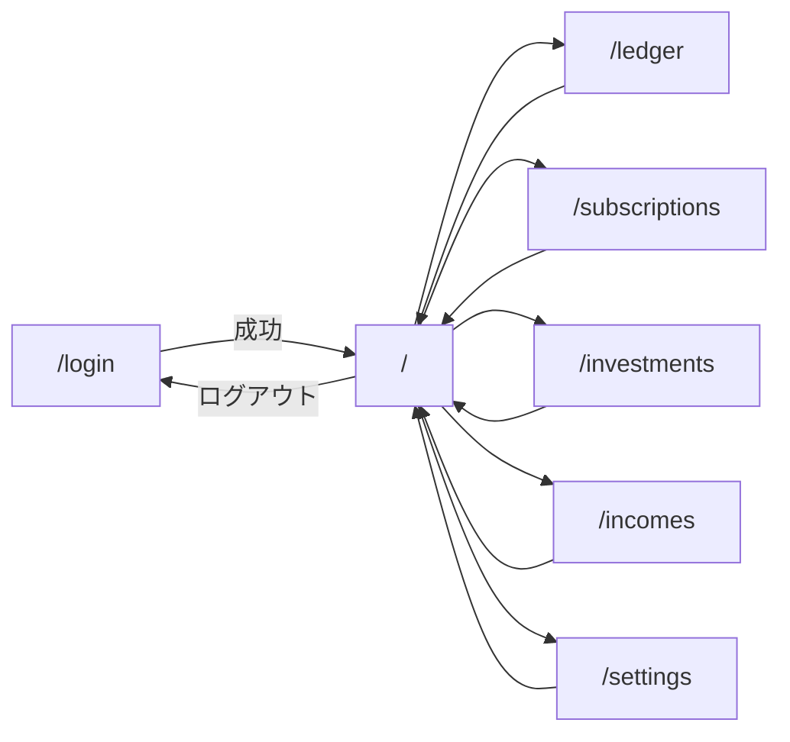

# seaweed 画面設計書

No.3 ／ 版 1.1 ／ 2026-08-30 ／ 入力: 要件定義書 1.3、システム構成 1.1、機能設計書 1.1 ／ 推敲: 認証の確定を反映

SPA パスはシステム構成・機能設計に従う。ピクセル指定はしない。見た目はデスクトップ Chrome を主、幅が狭いときは 1 列に積む（専用モバイル UI は作らない）。

## 目次

1. [共通](#1-共通)
2. [画面一覧と遷移](#2-画面一覧と遷移)
3. [S-LOGIN ログイン](#3-s-login-ログイン)
4. [S-APP 業務レイアウト](#4-s-app-業務レイアウト)
5. [S-DSH ダッシュボード](#5-s-dsh-ダッシュボード)
6. [S-LED 家計簿](#6-s-led-家計簿)
7. [S-SUB サブスク](#7-s-sub-サブスク)
8. [S-INV 投資記録](#8-s-inv-投資記録)
9. [S-INC 定期収入](#9-s-inc-定期収入)
10. [S-SET 手元資金と目標](#10-s-set-手元資金と目標)
11. [表示ルール](#11-表示ルール)
12. [後続への委譲](#12-後続への委譲)
13. [設計判断一覧](#13-設計判断一覧)

## 1. 共通

### 1.1 ページ構成

| 領域 | 内容 |
| --- | --- |
| ログイン | ナビなし。中央にフォーム |
| 業務 | 上にナビ（S-APP）。その下にページ本体 |

コンポーネント配置（実装時）: `frontend/src/layout/AppLayout.tsx`、`frontend/src/pages/*Page.tsx`。

### 1.2 セッションと遷移

| 事象 | 動作 |
| --- | --- |
| 未認証で `/` および `/ledger` 等 | `/login?from=<元のパス>` へ。`from` は `/` で始まる相対パスのみ採用。`//` や `http` を含む値は捨てて `from` なし |
| ログイン成功 | `from` があればそこへ、なければ `/` |
| ログイン済みで `/login` | `/` へ |
| 業務 API が 401 | 上記と同じリダイレクト（SPA が捕捉） |
| ログアウト成功 | `/login` へ。`from` は付けない |

パスワード変更・新規登録のリンクは出さない。

### 1.3 メッセージ

画面上部（ナビ直下）に 1 行。同時に出すのは最新 1 件。

| 種別 | 用途 |
| --- | --- |
| 成功 | 保存・削除のあと 3 秒で消す |
| エラー | API 400/404/5xx、入力不備。操作するまで残す |
| 情報 | 注意文（常設は各ページ内。バナーには使わない） |

文言の正（API が返す `message` があればそれを出す。無ければ下表）。

| 状況 | 文言 |
| --- | --- |
| ログイン失敗 | ユーザー名またはパスワードが正しくありません |
| 400 件数超過 | 件数が上限を超えました。期間を狭めてください |
| 400 その他 | 入力内容を確認してください |
| 404 | 対象が見つかりません。一覧を再読み込みしてください |
| ネットワーク／5xx | 通信に失敗しました。時間をおいてやり直してください |
| 保存成功 | 保存しました |
| 削除成功 | 削除しました |

削除の最終確認は `window.confirm` を使わない。対象行またはフォーム内に「本当に削除しますか」＋「削除する」「やめる」を出す。

### 1.4 ボタン

| 表示 | 動作 |
| --- | --- |
| 保存 | POST または PUT。送信中は二重送信防止（ボタン disabled） |
| キャンセル | フォームを新規状態に戻す（編集中の id を捨てる） |
| 削除 | 確認 UI を出す |
| 表示 | ダッシュボードの期間を適用して再取得 |

必須の未入力で保存した場合、ブラウザの `required` に加え、先頭の不備項目へフォーカスする。

## 2. 画面一覧と遷移



| ID | パス | タイトル（ナビ） | 機能 |
| --- | --- | --- | --- |
| S-LOGIN | `/login` | （なし） | F-AUTH |
| S-DSH | `/` | ダッシュボード | F-DSH |
| S-LED | `/ledger` | 家計簿 | F-LED |
| S-SUB | `/subscriptions` | サブスク | F-SUB |
| S-INV | `/investments` | 投資 | F-INV |
| S-INC | `/incomes` | 定期収入 | F-INC |
| S-SET | `/settings` | 設定 | F-SET |

CRUD は **一覧とフォームを同一パスに置く**。登録専用 URL・編集専用 URL は作らない。

## 3. S-LOGIN ログイン

**目的:** 識別子とパスワードでセッションを作る。

**初期フォーカス:** ユーザー名。

| 項目 | 種別 | 必須 | 備考 |
| --- | --- | --- | --- |
| ユーザー名 | text, autocomplete=username | はい | ラベル「ユーザー名」 |
| パスワード | password, autocomplete=current-password | はい | 表示切替は任意（無くてよい） |
| ログイン | submit | — | `POST /api/v1/auth/login` |

見出しは「seaweed」。説明文は「個人用。閉域からの利用を想定しています。」の 1 行まで。

空状態はなし（常にフォーム）。失敗は 1.3 のログイン失敗。

## 4. S-APP 業務レイアウト

全業務ページで共通。

```
seaweed | ダッシュボード  家計簿  サブスク  投資  定期収入  設定          {ユーザー名}  ログアウト
--------------------------------------------------------------------------------
（ページ本体）
```

| 要素 | 仕様 |
| --- | --- |
| 左端「seaweed」 | `/` へのリンク |
| ナビ | 現在パスと一致する項目を強調（`/` は完全一致のみ。`/ledger` でダッシュボードを強調しない） |
| ユーザー名 | `GET /api/v1/auth/me`。取得失敗時は空文字 |
| ログアウト | `POST /api/v1/auth/logout` のあと `/login` |

マウント時に `GET /api/v1/auth/me` を 1 回。401 なら 1.2。

## 5. S-DSH ダッシュボード

**目的:** 現状、費目内訳、予測、条件付き逆算を見る。書き込みボタンは置かない（設定・家計簿へのリンクのみ）。

**データ:** 表示のたびに `GET /api/v1/dashboard?from&to`。初回はクエリなし（サーバ既定 = 当月）。

### 5.1 期間（実績サマリ・内訳のみ）

| 項目 | 種別 | 初期 | 備考 |
| --- | --- | --- | --- |
| 開始日 | date | 当月 1 日 | 画面が JST の今日から算出してクエリに載せる。サーバ省略時と同じ値 |
| 終了日 | date | 当月末 | 同上 |
| 表示 | button | — | 両方入っているときだけ `from` `to` 付きで再取得。片方空はボタン disabled |

ラベル: 「実績の期間（資金決済日）」。予測ブロックはこの期間に連動しない旨を期間の右に小さく出す。

### 5.2 ブロック配置（上から）

1. 注意 3 行（常設）
2. 期間コントロール
3. 数値カード（現状）
4. 支出内訳
5. 予測（チャート・月次貯金額・到達・逆算）

**常設注意（この文言で出す）:**

- 給与は「定期収入」、サブスクは「サブスク」に登録してください。家計簿には書かないでください。
- 予測は「定期収入 − サブスク − 直近 3 完了月の変動支出平均」です。登録済みの未来の入出金を含みます。
- 投資の金額は投入額であり、時価ではありません。

### 5.3 数値カード

| 表示名 | 元 | 空・未設定 |
| --- | --- | --- |
| 手元資金 | `balance` | 未更新なら金額の代わりに「設定画面で手元資金を登録してください」＋ `/settings` リンク。チャートも出さない（処理仕様書と一致） |
| 手元資金の更新日 | 同 | 未更新なら「—」 |
| 期間の収入 | `periodSummary` | 0 円 |
| 期間の支出 | 同 | 0 円 |
| 期間の差額 | 同 | 0 円（収入−支出） |
| 定期収入（月額換算） | `incomeMonthlyTotal` | 0 円 |
| サブスク（月額換算） | `subscriptionMonthlyTotal` | 0 円 |
| 投資 件数 | `investmentSummary` | 0 |
| 投資 投入総額 | 同 | 0 円。注記「時価ではない」 |

差額が負なら数値を通常どおり（赤などの色分けは可。必須ではない）。

### 5.4 支出内訳

**設計判断:** 横棒グラフ。費目名が読める。金額の大きい順（API が順不同ならフロントで降順）。

| 状態 | 表示 |
| --- | --- |
| 期間内の支出 0 | グラフを出さず「この期間の家計簿支出はありません」 |
| 1 件以上 | 横棒＋右側に費目名と金額 |

サブスク合計はこのグラフに足さない。カード側を見る。

費目の表示名はコード定義書の日本語。未知コードはコード値をそのまま出す。

### 5.5 予測

| 要素 | 表示 |
| --- | --- |
| 月次貯金額 | 「毎月 ○ 円」正負そのまま。変動費データなしのときは API のフラグに従い「変動支出の実績がまだない（変動費 0 として計算）」を併記 |
| 折れ線チャート | 横軸: 年月（処理仕様の点列）。縦軸: 円。点のツールチップに金額 |
| チャート注記 | 「登録済みの未来の入出金を含みます」 |
| 手元資金未更新 | チャート・到達・逆算を出さず、5.3 の登録導線のみ |
| 到達時期 | 目標額あり: 「現状ペースで YYYY年M月頃」／到達不可／達成済み。目標なし: ブロックごと出さない |
| 逆算 | 目標ありかつ到達希望日あり: 「あと毎月 ○ 円の生活費削減」。0 以下なら「現状のままで達成可能」。希望日なし: 「希望時期を設定すると削減額が出せます」＋ `/settings` リンク。ブロックは出す |

チャート点の本数・月次粒度は処理仕様書。画面は受け取った点を順にプロットするだけ。

## 6. S-LED 家計簿

**レイアウト:** 上にフィルタ、中に一覧、下にフォーム（モーダルにしない）。

**常設注意:** 「給与・賞与の見込みは定期収入へ。サブスクの月額はサブスクへ。証券口座への入金は費目「投資拠出」。」

### 6.1 フィルタ

| 項目 | 種別 | 初期 | 備考 |
| --- | --- | --- | --- |
| 開始日 | date | 当月 1 日 | 必須 |
| 終了日 | date | 当月末 | 必須 |
| 日付の種類 | select | 資金決済日 | 発生日 / 資金決済日。API `dateField=occurred\|settled` |
| 表示 | button | — | `GET /ledger-entries` |

期間が揃っていないときは一覧を空にし、エラー「期間を指定してください」。

### 6.2 一覧

列（左から）: 資金決済日、発生日、区分、費目、支払手段、金額、摘要、操作。

| 操作 | 動作 |
| --- | --- |
| 編集 | その行をフォームへ載せる（6.3）。スクロールしてフォームへ |
| 削除 | 行の下または横に確認。確定で `DELETE` のあと一覧再取得 |

空: 「この期間の家計はありません」。新規は下のフォームで登録できる。

並び: 選択した日付の降順、同日は id 降順（API に合わせる。API 未規定なら画面で降順）。

**設計判断:** 一覧の既定ソートはフィルタ中の日付の降順。API設計書もこれに合わせる。

金額は区分が支出なら表示上マイナスを付けない（列「区分」で読む）。黒字の正の数。

### 6.3 フォーム

見出し: 新規時「家計を登録」、編集時「家計を編集（#id）」。

| 項目 | 種別 | 必須 | 初期（新規） | 備考 |
| --- | --- | --- | --- | --- |
| 区分 | select | はい | 支出 | 支出 / 収入。変更したら費目を空にする |
| 金額 | number min=0 step=任意 | はい | 空 | 0 不可。単位ラベル「円」 |
| 発生日 | date | はい | 今日（JST） | |
| 支払手段 | select | はい | 現金 | 表示名は 11.2 |
| 資金決済日 | date | 条件付き | 発生日と同じ | クレジットカードのとき必須・初期空 |
| 費目 | select | はい | 空（プレースホルダ「選択してください」） | 区分に応じて 11.3 |
| 摘要 | text maxlength=200 | はい | 空 | |

ボタン: 保存、キャンセル。編集時のみ削除（確認付き）。

#### 資金決済日の連動（FR-LED-10）

| きっかけ | 動作 |
| --- | --- |
| 支払手段がクレジットカード以外 | 資金決済日を発生日で上書きする（利用者が手で変えたあとも、発生日または支払手段が変わるたびに上書きする） |
| 支払手段をクレジットカードに変えた | 資金決済日を空にする。プレースホルダ「引落日を入力」 |
| クレジットカードのまま発生日変更 | 資金決済日は触らない |
| 保存時、クレカかつ資金決済日空 | 送信せず、資金決済日にフォーカス。「クレジットカードは引落日（資金決済日）が必要です」 |

クレジットカード以外はサーバ上も日付必須（発生日コピー後なので通常は埋まっている）。

## 7. S-SUB サブスク

**常設注意:** 「ここに登録した金額は予測の固定費になります。同じ月額を家計簿に書かないでください。」

レイアウトは家計簿と同じ（上一覧・下フォーム）。

### 7.1 一覧

列: 名称、周期、金額、月額換算（表示用。年額は ÷12 をフロントでも出してよい。正はサーバフィールドがあればそれ）、支払日、操作。

空: 「サブスクは未登録です」。

### 7.2 フォーム

| 項目 | 種別 | 必須 | 初期 | 備考 |
| --- | --- | --- | --- | --- |
| 名称 | text maxlength=100 | はい | 空 | |
| 金額 | number | はい | 空 | 0 不可。周期あたりの額 |
| 周期 | select | はい | 月額 | 月額 / 年額 |
| 支払日（月額） | number 1〜28 | はい | 1 | 周期が月額のとき表示 |
| 支払月（年額） | number 1〜12 | はい | 1 | 周期が年額のとき |
| 支払日（年額） | number 1〜28 | はい | 1 | 年額のとき。29〜31 は持たない |

**設計判断:** 支払日は 1〜28 のみ。月末 31 日契約は 28 と割り切る。予測計算には使わない。

## 8. S-INV 投資記録

**常設注意:** 「時価は扱いません。口座へ現金を出したときは家計簿の投資拠出にも登録してください。」

### 8.1 一覧

列: 投資日、銘柄、コード、理由（長いときは 40 文字＋省略）、単価、数量、投入金額、操作。

空: 「投資記録は未登録です」。並びは投資日の新しい順。

### 8.2 フォーム

| 項目 | 種別 | 必須 | 初期 | 備考 |
| --- | --- | --- | --- | --- |
| 投資日 | date | はい | 今日 | |
| 銘柄 | text maxlength=100 | はい | 空 | |
| コード | text maxlength=20 | いいえ | 空 | 証券コード任意 |
| 理由 | textarea maxlength=500 | はい | 空 | |
| 単価 | number min=0 | はい | 空 | 円。0 不可 |
| 数量 | number min=0 | はい | 空 | 0 不可。小数入力可 |
| 投入金額 | 読み取り専用 | — | 単価×数量 | フォーカス不可。未入力中は「—」 |

保存で投入金額は送らない。

## 9. S-INC 定期収入

**常設注意:** 「給与・賞与の見込みはここだけに書いてください。家計簿の収入には毎月の給与を書かないでください。」

一覧列: 名称、周期、金額、月額換算、操作。

フォームはサブスクから支払日を除いた形（名称・金額・周期）。支払日は定期収入に持たない（機能設計の属性どおり）。

## 10. S-SET 手元資金と目標

2 つの独立フォーム。それぞれの保存は対応する PUT のみ。

### 10.1 手元資金

| 項目 | 種別 | 必須 | 備考 |
| --- | --- | --- | --- |
| 金額 | number | はい | 0 以上を許可（口座ゼロ）。単位 円 |
| 最終更新 | 読み取り専用 | — | API の更新日。未更新は「未登録」 |
| 保存 | button | — | `PUT /settings/balance` |

説明: 「通帳などと見比べた現預金の合計です。家計の登録では自動では変わりません。」

### 10.2 貯蓄目標

| 項目 | 種別 | 必須 | 備考 |
| --- | --- | --- | --- |
| 目標額 | number | いいえ | 空 = 未設定。空で保存可 |
| 到達希望 | month | いいえ | 空可。目標額が空なら希望だけあっても画面上は保存可（サーバが希望を無視するかは処理仕様。画面は両方送る） |
| 保存 | button | — | `PUT /settings/goal` |

説明: 「希望時期は任意です。空のときはダッシュボードで到達時期だけ出ます。」

**設計判断:** 到達希望の入力は `type=month`（年月）。API へは `YYYY-MM-01` で渡す（API設計書）。

## 11. 表示ルール

### 11.1 数値・日付

| 対象 | 表示 |
| --- | --- |
| 金額 | 3 桁区切り＋「円」。小数は入力された桁（末尾の 0 は省略可） |
| 日付 | `YYYY-MM-DD` 入力、一覧は `YYYY/MM/DD` |
| 年月 | `YYYY/MM` |

クライアントの「今日」「当月」は `Asia/Tokyo`。`Date#getTimezoneOffset` に頼らず、表示用に JST の暦日を使う（実装は `Intl` または固定 offset +9）。

### 11.2 支払手段（表示名）

コード値はコード定義書。画面のラベルは次で固定する。

| 表示 | 決済日初期 |
| --- | --- |
| 現金 | 発生日 |
| 銀行口座 | 発生日 |
| クレジットカード | 空・必須 |
| 電子マネー・QR | 発生日 |
| その他 | 発生日 |

### 11.3 費目（表示名）

**支出:** 住居、食費、日用品、水道光熱、通信、交通、医療、教育、衣服、交際・娯楽、投資拠出、その他  
**収入:** 臨時収入、その他収入  

コードはコード定義書。マスタ編集 UI は置かない。

### 11.4 周期

表示: 月額、年額。

## 12. 後続への委譲

| 文書 | 内容 |
| --- | --- |
| API設計書 | JSON キー、`dateField`、目標の null、月額換算フィールドの有無 |
| コード定義書 | 11.2 / 11.3 の格納コード |
| 処理仕様書 | 未更新判定、チャート点、逆算の数値 |
| 認証セキュリティ設計書 | Cookie `SEAWEED_SESSION`・14 日・Secure=false。失敗回数によるロックはしない（確定） |

グラフライブラリは実装時に Recharts を第一候補とする（本書類の必須ではない）。

## 13. 設計判断一覧

| ID | 判断 | 理由 |
| --- | --- | --- |
| D-UI-01 | CRUD は同一パス。モーダルなし | 実装とフォーカス管理が単純 |
| D-UI-02 | ログイン後の `from` を使う | 深い URL への復帰 |
| D-UI-03 | 内訳は横棒・金額降順 | 費目名の可読性 |
| D-UI-04 | 予測は折れ線 | 推移の要件に直結 |
| D-UI-05 | クレカ以外は発生日変更で決済日を追従 | ラグなし手段の入力漏れを減らす |
| D-UI-06 | 支払日は 1〜28 | 月による 29〜31 の欠番を避ける |
| D-UI-07 | 到達希望は month 入力 | 日までの精度は逆算に不要 |
| D-UI-08 | 削除は画面内確認。`confirm()` なし | 誤操作防止を UI に残す |
| D-UI-09 | ダッシュボードに書き込みボタンを置かない | 機能設計の参照専用と一致 |
| D-UI-10 | ナビはテキスト 6 項目 | 個人・デスクトップ前提 |
