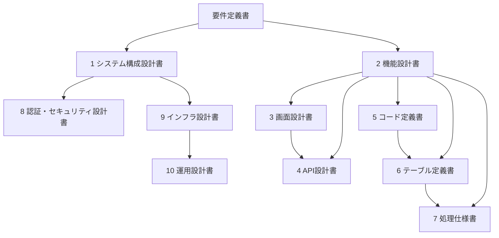

# seaweed 設計成果物一覧

| 項目 | 内容 |
| --- | --- |
| 文書種別 | 設計成果物の目録 |
| 対象 | 要件定義書（`docs/requirements/要件定義書.md` 版 1.3）に基づく今回開発 |
| 目的 | 設計書作成を依頼するときの文書名と範囲を揃える |

本文書は設計そのものではない。各成果物の中身は、本リストに沿って別途作成する。

---

## 1. 方針

- 名称は、Web システム開発で一般に使うものを用いる。
- 今回は個人利用・単一 EC2・外部連携なし・9 月リリースのため、**作る文書は必要最小**とする。
- 一般論としては存在するが今回作らないものは 3 章に置く。依頼時に含めない。

---

## 2. 今回作成する成果物

作成順は表の上から下を推奨する。上の文書を入力に、下を書く。

| No. | 一般的名称 | ファイル名（案） | 書くこと | 要件定義書との対応 |
| --- | --- | --- | --- | --- |
| 1 | システム構成設計書 | `docs/design/システム構成設計書.md` | 論理構成（React / Spring Boot / MySQL）、実行環境（同一 EC2）、閉域（Tailscale）、プロセスの待受、設定の置き場。図を含む | 3.1、5.4、6.2、TBD-07/08 |
| 2 | 機能設計書 | `docs/design/機能設計書.md` | 機能の分割、要件 ID（FR-*）との対応、画面・API・テーブルのどれが担うか。CRUD とダッシュボードの境界 | 3.2、4 章全体 |
| 3 | 画面設計書 | `docs/design/画面設計書.md` | 画面一覧、遷移、各画面の目的と主要項目、空・エラーの扱い。ワイヤーに近い表でよい。見た目のピクセル指定は不要 | 4.7、各 FR の画面要件 |
| 4 | API設計書 | `docs/design/API設計書.md` | React と Spring Boot 間の HTTP API。パス、メソッド、認証、リクエスト／レスポンスの概形。外部システム IF は対象外 | 機能設計書、画面設計書 |
| 5 | コード定義書 | `docs/design/コード定義書.md` | 費目、支払手段、周期、収支区分など、固定の区分値。画面の選択肢と DB の格納値 | 4.2.1、4.2.2、サブスク／定期収入の周期 |
| 6 | テーブル定義書 | `docs/design/テーブル定義書.md` | ER の概要、テーブル一覧、列（型・NULL・制約）、主キー／外部キー。金額は DECIMAL。初期データがあれば付す | 家計簿・マスタ・投資・手元資金・目標、NFR-02 |
| 7 | 処理仕様書 | `docs/design/処理仕様書.md` | ダッシュボードの集計・予測・逆算・支出内訳。起点日、完了暦月、未来の資金決済の載せ方、年額の月割り。CRUD の個別バリデーションのうち計算に効くもの | 4.3、4.3.3、FR-DSH-* |
| 8 | 認証・セキュリティ設計書 | `docs/design/認証セキュリティ設計書.md` | ログイン、セッション、パスワードハッシュ、未認証の拒否、閉域と SG、秘密情報の注入。公開 TLS は「採用しない」と明記 | 4.1、5.3、OUT-01、OUT-10 |
| 9 | インフラ設計書 | `docs/design/インフラ設計書.md` | EC2、OS 上の MySQL、セキュリティグループ、Tailscale、SSH、ディスクの目安。RDS・ALB は使わない旨 | 5.4、6.2、6.3、NFR-INF-* |
| 10 | 運用設計書 | `docs/design/運用設計書.md` | 起動停止、設定変更（認証情報・SG）、推奨バックアップ、障害時の切り分け（Tailscale / アプリ / DB） | 6 章、OPS-* |

### 2.1 各文書の関係

### 2.2 依頼時の単位

- 上表の **No. 単位**で作成を依頼する想定。
- 1 文書に章を足してマージしてもよいが、名称は変えない（後から「テーブル定義書はどこ」と探すため）。
- 画面のモック画像、OpenAPI の機械可読ファイル、DDL ファイルは、各設計書の本文が先。必要なら設計書に「付録として出す」と書く。

---

## 3. 今回作成しない成果物

要件上、対象がないか、他文書の一文で足りるもの。

| 一般的名称 | 作らない理由 |
| --- | --- |
| 帳票設計書 | 帳票・PDF 出力がない |
| 外部インターフェース設計書 | 銀行・カード・証券・株価 API がない。ブラウザ〜自前 API は API設計書で扱う |
| バッチ設計書 | 定期バッチ・ジョブの要件がない |
| 権限設計書 | 利用者が 1 名。認証・セキュリティ設計書に含める |
| 移行設計書 | 既存データ移行が対象外 |
| 性能設計書 | 同時接続・スループット目標がない |
| ネットワーク詳細設計書（セグメント図等） | 単一インスタンス。到達制御はシステム構成とインフラに含める |
| 公開 TLS / 証明書設計書 | 公開 HTTPS が対象外。認証・セキュリティ設計書で非採用と書く |

詳細設計書を「クラス図・シーケンス図の全集」として別冊にする必要はない。処理の分岐は処理仕様書、API の入出力は API設計書で足りる。実装時のパッケージ構成は機能設計書かシステム構成に短く書けばよい。

---

## 4. 入力と出力の置き場

| 種類 | 場所 |
| --- | --- |
| 入力 | `docs/requirements/要件定義書.md` |
| 本目録 | `docs/design/設計成果物一覧.md` |
| 設計書 | `docs/design/` 配下（2 章のファイル名） |

設計書は要件を言い換えず、**決めた方式**（パス、型、画面項目、計算の手順）を書く。要件のコピーだけで終わらないこと。
