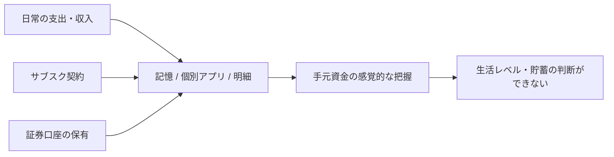
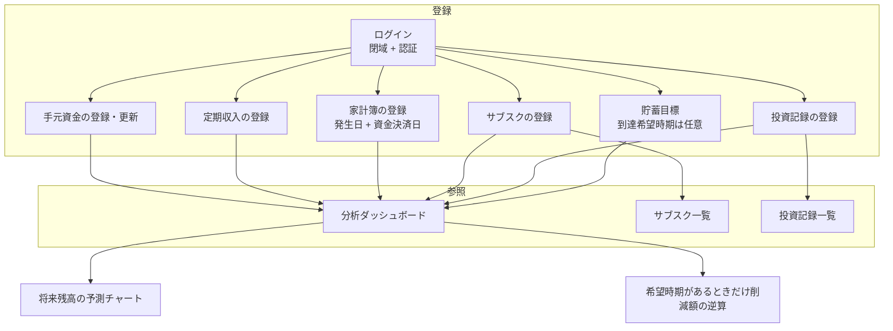

# seaweed 要件定義書

| 項目 | 内容 |
| --- | --- |
| システム名 | seaweed |
| 文書種別 | 要件定義書 |
| 対象読者 | 本システムの設計・実装を行う開発者（兼利用者） |
| 版 | 1.3 |
| 作成日 | 2026-08-30 |
| 改訂日 | 2026-08-30 |
| 入力 | `docs/requirements/prompt.md`、TBD-01〜08 の確定、基本設計前の確認 |

本書類は、個人の生活資金・固定費・投資状況を可視化する Web アプリケーション **seaweed** の要件を定義する。後続の設計書作成の入力として用いる。

TBD-01〜08 は 7.1 のとおり確定した。推奨案を採用した項目（TBD-02 / 05 / 07 / 08）は、方針を変える場合に 7.1 の代替案を参照する。版 1.3 で、家計簿の費目とダッシュボードの当月支出内訳を Must とした。

---

## 1. システム化の目的と背景

### 1.1 背景

利用者は、手元資金に対する日々の収支およびキャッシュフローを把握できていない。支出の発生タイミングと、クレジットカード等による実際の資金流出タイミングがずれるため、通帳残高や感覚だけに頼ると「今いくら使えて、将来いくら残るか」が見えにくい。

加えて、サブスクリプション（以下、サブスク）や株式投資の状況が分散しており、固定費の見直しや、いつ・なぜその銘柄に投資したかの記録が残しづらい。

### 1.2 課題

現状の課題を次のとおり整理する。

| ID | 課題 | 影響 |
| --- | --- | --- |
| P-01 | 日々の収支が記録・集約されていない | 生活費の実態が不明で、生活レベルの適否を判断できない |
| P-02 | クレジットカード等の支払いラグを考慮できていない | 発生ベースの感覚と、実際の手元資金の動きが乖離する |
| P-03 | 将来の貯金額・到達時期が見えない | 貯蓄目標に対する行動（節約量）を定量化できない |
| P-04 | サブスクが一元管理されていない | 固定費の見直し材料がない |
| P-05 | 投資の実行記録（日時・銘柄・理由・単価・数量）が残っていない | 投資判断の振り返りと、投入資金の把握ができない |

### 1.3 目的・ゴール

本システムの目的は、次の 2 点である。

1. **生活資金の現状と将来予測を可視化し、生活レベルを適正化する。**
2. **サブスクと投資記録を一元管理し、固定費の見直しおよび投資判断の把握を可能にする。**

達成イメージ（プロンプトで示された可視化）は次のとおり。

- 現在の生活費を続けた場合、「毎月いくら貯金でき、いつ頃に X 万円に到達するか」をチャートで示す。
- 「Y 万円まで貯めたい」場合に、「生活費をあといくら削る必要があるか」を逆算して示す。到達希望時期は任意である（設定しているときだけ逆算する）。

### 1.4 成功の定義

次を満たしたとき、目的を達成したとみなす。

| ID | 成功条件 |
| --- | --- |
| G-01 | 収支を、発生日と資金決済日の両方で登録・参照できる |
| G-02 | 手元資金の現状と、将来の残高推移予測をダッシュボードで確認できる |
| G-03 | 貯蓄目標額に対し、現状ペースでの到達時期を示せる。到達希望時期があるときは、削減すべき生活費も示せる |
| G-04 | 契約中サブスクの名称・金額を登録・一覧・編集・削除できる |
| G-05 | 投資記録（いつ、どの銘柄、理由、単価、数量）を登録・一覧・削除できる |
| G-06 | 定期収入と手元資金を登録し、予測の入力として使える |
| G-07 | 家計簿に費目を付け、ダッシュボードで当月（既定）の支出内訳を確認できる |

### 1.5 用語定義

| 用語 | 定義 |
| --- | --- |
| 発生日 | 購買・収入が発生した日（レシート日など） |
| 資金決済日 | 実際に手元資金（口座・現金）が増減する日。現金・即時決済は発生日と同一。クレジットカードは引落日 |
| 計上 | 家計簿上の 1 件の収支レコード。発生日と資金決済日を持つ |
| 手元資金 | 予測の起点となる、利用者が把握している現預金残高の合計。手動で登録・更新する |
| 調整手元資金 | 手元資金に、資金決済日が起点日より後の家計簿を加減した額。到達時期・逆算の起点に使う |
| 定期収入 | 給与など、予測に用いる繰り返しの収入。マスタとして登録する |
| 費目（カテゴリ） | 家計簿の 1 件に付ける支出・収入の分類。固定リスト（4.2.2） |
| 支出内訳 | 指定期間の家計簿支出を費目ごとに合計した表示。ダッシュボードに出す |
| 変動支出 | 家計簿に計上する、サブスク以外の支出（食費・日用品など） |
| 生活費 | 予測上の支出水準。固定費（サブスク）と変動支出の平均の合計。算出は 4.3.3 |
| 貯蓄目標 | 利用者が設定する到達したい金額 |
| 到達希望時期 | 貯蓄目標をいつまでに達成したいか。任意。未設定のときは逆算を行わない |
| 投資記録 | 1 回の投資実行。投資日、銘柄、理由、単価、数量を持つ |
| 閉域アクセス | インターネットにサービスを公開せず、利用者の端末からのみ到達させる方式（本システムでは Tailscale を採用） |

---

## 2. 業務フロー（現状と改善後）

### 2.1 現状（As-Is）

家計・固定費・投資はシステム化されていない。記録がある場合でも、メモ・各社アプリ・証券口座画面などに分散し、次の状態にある。



- 支払いラグを加味したキャッシュフローは追っていない。
- 将来残高や「いくら削れば目標に届くか」は都度、手計算または未実施。

### 2.2 改善後（To-Be）概要

利用者が seaweed にマスタ・実績を登録し、ダッシュボードで現状と予測を確認する。



### 2.3 主要シナリオ

#### 2.3.1 アクセスと認証

1. 利用者の端末は Tailscale で EC2 と同一の閉域網に入る。
2. 閉域外（インターネットからの直接アクセス）ではサービスポートに到達できない。
3. 閉域内でログイン画面を開き、識別子とパスワードで認証する。
4. 認証後、家計簿・ダッシュボード等を利用できる。

#### 2.3.2 家計簿の登録（支払いラグあり）

1. 利用者が支出または収入（臨時）を登録する。給与等の定期収入とサブスクは、原則として家計簿ではなく各マスタへ登録する（4.3.3）。
2. 区分、金額、発生日、支払手段、カテゴリ、内容を入力する。
3. 支払手段がクレジットカード等で資金流出が後になる場合、資金決済日を発生日と別に指定する。即時決済では資金決済日を発生日と同じにする（入力補助あり）。
4. 登録内容は一覧で確認し、誤りのときは編集または削除する。

#### 2.3.3 サブスクの登録・維持

1. 利用者が契約中サブスク（名称、金額、周期等）を登録する。
2. 一覧で確認し、金額変更・解約に応じて編集または削除する。

#### 2.3.4 投資記録の登録・参照

1. 利用者が投資実行のたびに記録する（投資日、銘柄、理由、単価、数量）。
2. 一覧で確認する。誤りは削除し、必要なら打ち直す。訂正のための編集もできる。

#### 2.3.5 現状把握と将来予測

1. 利用者が手元資金・定期収入・貯蓄目標を登録する。到達希望時期は任意である。
2. ダッシュボードで、現状の収支と、当月（既定）の費目別支出内訳、将来の手元資金推移を確認する。
3. 目標額があれば、現状ペースでの到達時期を表示する。
4. 到達希望時期が設定されているときだけ、必要な生活費削減額を表示する。
5. 投資記録の要約（投入総額、件数）をダッシュボードに表示する。予測残高には時価変動を加えない。資金決済日が未来の家計は、チャート上のその決済タイミングで残高に反映する。

### 2.4 アクター

| アクター | 人数 | 説明 |
| --- | --- | --- |
| 利用者 | 1 名 | 開発者本人。すべての機能を利用する唯一のユーザー |

外部の承認者・運用担当は置かない。

---

## 3. 対象範囲（スコープ）

### 3.1 システム化の範囲

本システムは、個人利用の Web アプリケーションである。ブラウザから操作し、サーバーサイドでデータを永続化する。

| 層 | 方針 |
| --- | --- |
| フロントエンド | React |
| バックエンド | Java（Spring Boot） |
| データベース | MySQL |
| 実行環境 | AWS EC2 上でアプリケーションおよび MySQL を稼働する。Amazon RDS は使用しない |
| 到達制御 | インターネットに HTTP/HTTPS を公開しない。Tailscale による閉域アクセスを用いる（7.1 TBD-07） |

### 3.2 In Scope（今回実装する範囲）

| ID | 範囲 | 概要 |
| --- | --- | --- |
| IN-01 | 認証 | 簡易ログイン。到達制御は Tailscale 閉域（アプリ内の許可 IP リストは持たない） |
| IN-02 | 家計簿 | 収支の登録・編集・削除。発生日／資金決済日、支払手段、カテゴリ |
| IN-03 | 分析ダッシュボード | 現状把握、費目別の支出内訳、将来の手元資金推移シミュレーション、予測チャート、条件付き逆算 |
| IN-04 | サブスク管理 | 利用中サブスクの登録・一覧・編集・削除 |
| IN-05 | 投資記録 | 投資実行の登録・一覧・編集・削除（属性は 4.5） |
| IN-06 | 手元資金 | 予測起点となる現預金残高の登録・更新 |
| IN-07 | 貯蓄目標 | 目標金額の設定。到達希望時期は任意 |
| IN-08 | 定期収入 | 給与等の繰り返し収入の登録・編集・削除 |

### 3.3 Out of Scope（今回対象外）

| ID | 範囲 | 備考 |
| --- | --- | --- |
| OUT-01 | パスワード変更機能 | 初期投入した認証情報を画面から変更する機能は作らない |
| OUT-02 | ダッシュボードにおける AI 活用 | 予測はルールベースのシミュレーションとする |
| OUT-03 | 株式関連ニュース・RSS の収集 | 行わない |
| OUT-04 | 複数ユーザー・権限管理 | 利用者は 1 名 |
| OUT-05 | 金融機関・クレジットカード・証券会社との API 連携 | 明細の自動取込は行わない |
| OUT-06 | 株価・為替の自動取得、時価評価、売却・損益計算 | 投資は実行記録の台帳に限定する |
| OUT-07 | 高可用性、負荷分散、RDS、マネージドバックアップ | 個人利用かつ構成簡略化のため対象外 |
| OUT-08 | スマホネイティブアプリ | Web ブラウザ利用を前提とする（Tailscale 経由ならモバイルブラウザも可） |
| OUT-09 | 既存システムからのデータ移行 | 新規構築。過去データの一括移行は対象外 |
| OUT-10 | インターネットへのサービス公開、独自ドメイン、公開用 TLS 終端 | 閉域アクセスを採用するため不要（7.1 TBD-08） |
| OUT-11 | カテゴリ・支払手段のマスタ編集画面 | 初期は固定選択肢とする |
| OUT-12 | 家計簿へのサブスク／定期収入の自動仕訳 | マスタと家計簿は役割を分ける（4.3.3） |

### 3.4 利用者・利用形態

- 利用者は自分のみ（1 名）。
- 利用場所は Tailscale に接続できる端末（自宅・外出先・モバイル）とする。
- インターネットからの匿名アクセスはできない。

---

## 4. 機能要件定義

機能 ID は後続設計のトレーサビリティに用いる。優先度は次のとおり。

| 優先度 | 意味 |
| --- | --- |
| Must | 2026 年 9 月リリースに含める。欠けると目的を達成できない、または運用上ほぼ必須として取り込むもの |
| Could | あると良いが、9 月リリースでは作らない |

### 4.1 認証機能

完全個人利用を前提とした、最小限の認証とする。ネットワーク到達とログインを重ねる。

| ID | 要件 | 優先度 | 詳細 |
| --- | --- | --- | --- |
| FR-AUTH-01 | 閉域到達 | Must | サービスは Tailscale 網内からのみ到達できる。EC2 のセキュリティグループでは、アプリ用 HTTP ポートを 0.0.0.0/0 に開放しない |
| FR-AUTH-02 | 許可 IP リスト | — | アプリケーション内の許可 IP 設定は持たない。動的 IP 対策を Tailscale に委譲する |
| FR-AUTH-03 | ログイン | Must | 識別子（ユーザー ID またはログイン名）とパスワードによる簡易ログイン。アカウントは 1 件 |
| FR-AUTH-04 | セッション | Must | ログイン後、一定期間またはブラウザ終了まで認証状態を維持する。有効期間は設計で定める |
| FR-AUTH-05 | ログアウト | Must | 明示的に認証状態を破棄できる |
| FR-AUTH-06 | 未認証時の保護 | Must | 未ログインでは家計簿・ダッシュボード等の業務機能を利用できない |
| FR-AUTH-07 | パスワード変更 | — | 対象外（OUT-01）。変更が必要な場合はサーバー上の設定変更で対応する |

閉域であってもログインは残す。端末の紛失・共有、Tailscale 接続済みの別プロセスからのアクセスに備える。

### 4.2 家計簿管理機能

収支の CRUD と、支払いラグを表現する日付管理を行う。

| ID | 要件 | 優先度 | 詳細 |
| --- | --- | --- | --- |
| FR-LED-01 | 収支の登録 | Must | 収入・支出を 1 件ずつ登録できる。ここでの収入は臨時収入を主とする（定期収入は 4.6） |
| FR-LED-02 | 必須属性 | Must | 区分（収入／支出）、金額（円）、発生日、資金決済日、支払手段、カテゴリ、内容（摘要） |
| FR-LED-03 | 支払いラグ | Must | 発生日と資金決済日を独立して登録できる |
| FR-LED-04 | 支払手段 | Must | 固定選択肢から選ぶ。値と入力補助は 4.2.1 |
| FR-LED-05 | カテゴリ | Must | 固定選択肢から選ぶ。値は 4.2.2。マスタ編集画面は対象外 |
| FR-LED-06 | 収支の編集 | Must | 登録済みレコードを修正できる |
| FR-LED-07 | 収支の削除 | Must | 登録済みレコードを削除できる。物理削除でよい |
| FR-LED-08 | 収支の一覧 | Must | 期間（発生日または資金決済日）で絞り込み、一覧表示できる |
| FR-LED-09 | 金額 | Must | 入力・表示の通貨は日本円。内部表現は十進（DECIMAL）。v1 で外貨建ての入力・換算 UI は作らない。桁数は設計で定める |
| FR-LED-10 | 資金決済日の入力補助 | Must | 支払手段に応じて資金決済日の初期値を入れる。クレジットカードは初期値を入れず、未入力なら登録できない |

**支払いラグの例**

| ケース | 発生日 | 資金決済日 |
| --- | --- | --- |
| 現金で食費を支払った | 購入日 | 購入日 |
| クレジットカードで購入し、翌月引落 | 購入日 | カード引落日 |
| 給与振込（家計簿に書く場合） | 支給日 | 振込入金日（通常は同日） |

ダッシュボードのキャッシュフローおよび予測に使う家計簿集計は **資金決済日** を主軸とする。発生日ベースの集計の併記は 9 月リリースでは作らない。

#### 4.2.1 支払手段（TBD-05 採用）

固定の列挙とし、利用者が選択肢を増やせない。

| 値 | 意味 | 資金決済日の初期値 |
| --- | --- | --- |
| 現金 | 手元現金 | 発生日と同じ |
| 銀行口座 | 口座振替・振込・デビット（即時または指定日） | 発生日と同じ（変更可） |
| クレジットカード | 後払い。引落で手元資金が減る | 初期値なし。利用者が引落日を入力する |
| 電子マネー・QR | 前払い残高または即時 | 発生日と同じ |
| その他 | 上記以外 | 発生日と同じ（変更可） |

クレジットカードを選んだときは資金決済日を必須とする。引落日マスタ（カードごとの既定日）は初期対象外とする。

#### 4.2.2 カテゴリ（TBD-05 採用）

区分に応じて固定の列挙から選ぶ。「その他」で漏れを吸収する。名称の追加・改名画面は作らない。

**支出**

| 値 | 含めるものの目安 |
| --- | --- |
| 住居 | 家賃、住宅ローン、管理費 |
| 食費 | 食料品、外食 |
| 日用品 | 消耗品、雑貨 |
| 水道光熱 | 電気・ガス・水道 |
| 通信 | スマホ、インターネット（サブスクマスタに載せるものは家計簿に書かない） |
| 交通 | 電車、バス、ガソリン |
| 医療 | 病院、薬 |
| 教育 | 書籍、習い事 |
| 衣服 | 衣類、靴 |
| 交際・娯楽 | 趣味、旅行、交際費 |
| 投資拠出 | 証券口座への入金など、投資記録とは別の「現金が口座を出た」事実 |
| その他 | 上記以外 |

**収入（家計簿側。臨時が主）**

| 値 | 含めるものの目安 |
| --- | --- |
| 臨時収入 | 還付、贈与、売得など |
| その他収入 | 上記以外 |

給与・賞与の毎月の見込みは定期収入マスタへ登録する。家計簿の収入カテゴリに「給与」を置かないことで、予測との二重計上を防ぐ。

### 4.3 分析ダッシュボード機能

AI は用いない。計算前提はダッシュボード上に短い文言で示す（例: 「定期収入 − サブスク − 直近 3 完了月の変動支出平均」）。

#### 4.3.1 現状把握

| ID | 要件 | 優先度 | 詳細 |
| --- | --- | --- | --- |
| FR-DSH-01 | 手元資金の表示 | Must | 登録済みの手元資金を表示する |
| FR-DSH-02 | 期間収支サマリ | Must | 指定期間（既定: 当月、資金決済日ベース）の家計簿収入合計・家計簿支出合計・差額を表示する。これは実績であり、予測の式とは切り分ける |
| FR-DSH-03 | サブスク固定費の表示 | Must | 登録済みサブスクの月額換算合計を固定費として表示する |
| FR-DSH-04 | 投資記録の要約 | Must | 件数、投入総額（単価 × 数量の合計）を表示する。時価は出さない |
| FR-DSH-09 | 定期収入の表示 | Must | 登録済み定期収入の月額換算合計を表示する |
| FR-DSH-10 | 支出内訳 | Must | 家計簿の支出を費目（4.2.2）ごとに合計し、ダッシュボードに出す。期間は期間収支サマリと同一（既定: 当月、資金決済日ベース）。グラフ種別（円・棒など）は設計で定める。金額 0 の費目は出さなくてよい。対象期間に支出が無いときはその旨を示す。サブスクマスタの固定費はこの内訳に足さない（FR-DSH-03 を見る） |

#### 4.3.2 将来予測

| ID | 要件 | 優先度 | 詳細 |
| --- | --- | --- | --- |
| FR-DSH-05 | 月次貯金額の算出 | Must | 4.3.3 の式で算出し表示する |
| FR-DSH-06 | 残高推移チャート | Must | 将来の手元資金推移をチャート表示する。横軸は時間、縦軸は金額。計算は 4.3.3。資金決済日が未来の家計簿を、その決済のタイミングで反映する |
| FR-DSH-07 | 目標到達時期 | Must | 貯蓄目標額があるとき、現状ペースで到達する時期を表示する。到達しない場合はその旨を示す。到達希望時期は使わない |
| FR-DSH-08 | 逆算 | Must | 貯蓄目標額があり、かつ到達希望時期が設定されているときに限り、必要な生活費削減額を表示する。希望時期が空なら逆算ブロックは出さない（または「希望時期を設定すると算出します」と示す） |

#### 4.3.3 予測ロジック（TBD-02 採用）

役割を分け、足し算で二重計上しない。

| データの種類 | 置き場 | 現状サマリ | 将来予測 |
| --- | --- | --- | --- |
| 手元資金 | 手元資金マスタ | 表示する | 起点残高 |
| 給与等の繰り返し収入 | 定期収入マスタ | 月額換算を表示 | 月次収入に使う |
| サブスク | サブスクマスタ | 月額換算を表示 | 月次固定費に使う |
| 変動する支出・臨時収入 | 家計簿 | 期間合計に使う | 支出のうち変動費の平均にだけ使う。家計簿の収入は予測に使わない |
| 投資記録 | 投資記録 | 投入総額の表示 | 予測残高に加えない（現金は投資拠出を家計簿に書いた時点で減っている想定） |

**運用ルール（画面上でも短く示す）**

- サブスクはマスタにだけ書く。家計簿に毎月の引落を書かない。
- 給与等は定期収入マスタに書く。家計簿に毎月の給与を書かない。
- 家計簿は変動支出と臨時収入の実績台帳とする。
- 証券口座へ現金を移したときは家計簿を「投資拠出」で切り、投資の中身は投資記録に書く。

**月次貯金額**

```
月次収入     = 定期収入の月額換算合計
月次固定費   = サブスクの月額換算合計（年額は ÷ 12）
月次変動費   = 直近 3 完了暦月の、家計簿の支出合計（資金決済日ベース）÷ 3
月次貯金額   = 月次収入 - 月次固定費 - 月次変動費
```

- 「完了暦月」とは、今日を含まない直近の暦月 3 つ（例: 8/30 なら 5・6・7 月）。当月途中を平均に混ぜない。
- 完了月が 3 未満のときは、ある完了月だけで平均する。0 ヶ月のときは月次変動費を 0 とし、「変動支出の実績がまだない」と表示する。
- 賞与は定期収入を年額または「12 で割った月額」として登録する（賞与月だけのスパイクは予測に出さない）。家計簿へ賞与を書いた場合も、予測の収入側はマスタのみなので二重にならない。実績サマリには賞与が出る。

**残高推移（確定の未来決済 + 見込）**

チャートの起点日は、手元資金の最終更新日（日付）とする。未更新ならダッシュボードで登録を促し、チャートは出さない。

```
残高(t) = 手元資金
        + Σ 家計簿（起点日 < 資金決済日 ≤ t）の符号付き金額
        + 月次貯金額 × 起点日から t までの経過完了月数
```

- 家計簿の支出は減算、収入は加算する。
- 定期収入マスタとサブスクマスタは、月次貯金額の内訳として毎月の見込に含まれる。家計簿へは書かないため、確定分の Σ には入らない。
- 資金決済日が起点日より後の家計は、その決済日（または決済月。粒度は設計）でチャートに載せる。例: 来月引落のクレジットカードは、引落のタイミングで残高が下がって見える。
- 経過完了月数の数え方（月末点か、日割りしないか）は設計で定める。v1 は月次の点でよい。

**見込と確定の重なり（既知の限界）**

月次貯金額の変動費は過去 3 完了月の平均である。一方、すでに発生してまだ引落前の支出（来月のカード引落など）は確定分としてチャートに載る。同じ月に「平均的な生活費」と「その月の確定引落」が重なり、その月だけ実際より厳しく見えることがある。v1 ではこの重なりを許容し、チャート付近に「登録済みの未来の入出金を含みます」と示す。確定だけを見込の変動費から差し引く調整は、9 月リリースでは行わない。

**予測に含めないもの**

- 株価変動による評価損益
- 配当・株主優待
- 税金・社会保険の精緻な見積
- 家計簿上の収入実績のうち、資金決済日が起点日以前のもの（実績サマリ側で見る）
- 投資記録そのもの（現金の移動は、家計簿の投資拠出または未来の資金決済として載っている範囲だけ）

**到達時期（希望時期なしでも可）**

到達時期・逆算に使う起点は、チャートの確定分を織り込んだ調整手元資金とする。

```
調整手元資金 = 手元資金 + Σ 家計簿（資金決済日 > 起点日）の符号付き金額
```

- 目標未設定なら到達時期は出さない。
- 月次貯金額 > 0 かつ 目標 > 調整手元資金 のとき、`ceil((目標 - 調整手元資金) / 月次貯金額)` ヶ月後を到達時期とする。
- 月次貯金額 ≤ 0 のときは到達不可と表示する。
- 目標 ≤ 調整手元資金 のときは達成済みと表示する。

**逆算（到達希望時期があるときだけ）**

目標額 Y 円を T ヶ月後（到達希望時期から算出）に達成したい場合:

```
必要な月次貯金額 = (Y - 調整手元資金) / T
削減すべき生活費 = 必要な月次貯金額 - 現状の月次貯金額
```

- T ≤ 0、または目標 ≤ 調整手元資金 のときは逆算しない（達成済みまたは不正）。
- 削減額が 0 以下なら、現状のままで達成可能と表示する。

### 4.4 サブスク管理機能

| ID | 要件 | 優先度 | 詳細 |
| --- | --- | --- | --- |
| FR-SUB-01 | サブスクの登録 | Must | 契約中サービスを登録できる |
| FR-SUB-02 | 登録属性 | Must | サービス名、金額（DECIMAL）、周期（月額／年額） |
| FR-SUB-03 | 支払日 | Must | 毎月または毎年の支払日。予測の月額換算には使わない。一覧と固定費の見通しに使う |
| FR-SUB-04 | 一覧参照 | Must | 登録済みサブスクを一覧表示する |
| FR-SUB-05 | 編集・削除 | Must | 金額変更・解約に対応する。削除は物理削除でよい |
| FR-SUB-06 | 家計簿との関係 | Must | 自動仕訳はしない。予測上の固定費は本マスタのみを見る |

年額は月額換算（÷ 12）してダッシュボードと予測に載せる。円未満の丸めは設計で定める（DECIMAL のまま計算し、表示時に丸めてよい）。

### 4.5 投資管理機能

リリース時点の対象は **投資実行の記録** である。現在の時価による保有評価、売却、損益、ニュースは対象外。

1 レコードが「いつ、どの銘柄に、どのような理由で、どれだけ（単価・数量）投資したか」を表す。

| ID | 要件 | 優先度 | 詳細 |
| --- | --- | --- | --- |
| FR-INV-01 | 投資記録の登録 | Must | 1 回の投資実行を登録できる |
| FR-INV-02 | 登録属性 | Must | 投資日、銘柄名（コードは任意）、投資理由、単価、数量。単価・数量・投入金額は十進（DECIMAL）。投入金額は `単価 × 数量` で表示し、手入力させない。v1 の入力通貨は円のみ |
| FR-INV-03 | 一覧参照 | Must | 投資日の新しい順などを一覧表示する。投入金額も出す |
| FR-INV-04 | 編集 | Must | 理由の誤記などを訂正できる |
| FR-INV-05 | 削除 | Must | 誤登録を削除できる。物理削除でよい |
| FR-INV-06 | 時価・売却 | — | 対象外 |
| FR-INV-07 | ダッシュボード連携 | Must | 件数と投入総額を表示する。将来の手元資金予測には加算しない。現金の減少は家計簿の投資拠出（未来の資金決済日があればチャートの確定分）で表す |

同一銘柄への追加購入は、行を分けて記録する。平均取得単価の自動計算は 9 月リリースでは作らない。

### 4.6 手元資金・定期収入・貯蓄目標

| ID | 要件 | 優先度 | 詳細 |
| --- | --- | --- | --- |
| FR-BAL-01 | 手元資金の登録・更新 | Must | 現預金の合計を 1 件登録・更新できる。金額は DECIMAL。口座内訳の分割は 9 月リリースでは作らない |
| FR-INC-01 | 定期収入の登録 | Must | 名称、金額（DECIMAL）、周期（月額／年額）を登録できる |
| FR-INC-02 | 定期収入の編集・削除 | Must | 昇給・転職に対応する |
| FR-INC-03 | 定期収入の一覧 | Must | 登録内容を一覧できる |
| FR-GOAL-01 | 貯蓄目標の設定 | Must | 目標金額（DECIMAL）を設定できる。初期は 1 件。未設定（目標なし）を許容する |
| FR-GOAL-02 | 到達希望時期 | Must | 任意項目。空でも目標額だけの運用ができる。空のときは FR-DSH-08 を出さない |

### 4.7 画面の要件レベル一覧

画面設計は設計書の範囲とする。要件として必要な画面・状態は次のとおり。

| 画面 | 目的 |
| --- | --- |
| ログイン | 認証（閉域内） |
| 家計簿一覧・登録・編集 | 収支 CRUD、日付 2 種、支払手段、カテゴリ |
| サブスク一覧・登録・編集 | 固定費の CRUD |
| 投資記録一覧・登録・編集 | 投資実行の CRUD（削除含む） |
| 定期収入一覧・登録・編集 | 予測用収入の CRUD |
| ダッシュボード | 現状、費目別支出内訳、予測チャート、条件付き逆算 |
| 手元資金・貯蓄目標 | 予測の入力（到達希望時期は任意。他画面に内包してもよい） |

---

## 5. 非機能要件定義

プロンプト上、可用性や高度なセキュリティはスコープ外である。設計・実装・運用が成立する最小限を次に定義する。これ以上の SLA・監査・冗長化は求めない。

### 5.1 品質特性の扱い

| 特性 | 方針 |
| --- | --- |
| 可用性 | 単一 EC2。停止・障害時の SLA は定めない。個人利用の範囲で復旧できればよい |
| 性能 | 単一利用者が操作してストレスなく表示できること。具体的な同時接続数・スループット目標は設けない |
| 拡張性 | マルチテナントや大規模データは想定しない |
| セキュリティ | 閉域（Tailscale）+ ログイン。公開 HTTPS、WAF、多要素認証、ペネトレーションテストは対象外 |
| 保守性 | 後から設計書・実装を追えること。過度な抽象化はしない |

### 5.2 環境・データ

| ID | 要件 |
| --- | --- |
| NFR-01 | タイムゾーンは日本標準時（JST）とする |
| NFR-02 | 入力・表示の通貨は日本円とする。金額・単価・数量・投入金額は DECIMAL で保持する。v1 で通貨コードの切替 UI は持たないが、スキーマは小数を前提とし、将来の他通貨追加で整数前提の作り直しをしない |
| NFR-03 | 対応ブラウザは、利用者が使う最新のデスクトップ Chrome または同等のモダンブラウザとする。Tailscale 経由のモバイルブラウザは可とするが、専用 UI は作らない |
| NFR-04 | データ量は個人の数年分の家計・サブスク・投資記録を想定し、特別なシャーディングは不要 |
| NFR-05 | 文字コードは UTF-8 とする |

### 5.3 セキュリティ（最小）

| ID | 要件 |
| --- | --- |
| NFR-SEC-01 | アプリの待受はインターネットに公開しない。EC2 セキュリティグループでアプリポートを全世界へ開放しない |
| NFR-SEC-02 | 業務 API・画面は認証必須とする |
| NFR-SEC-03 | パスワードは平文保存しない（ハッシュ化） |
| NFR-SEC-04 | 公開用のドメイン取得・Let's Encrypt・ALB による TLS 終端は行わない。端末〜EC2 の通信の機密性は Tailscale のトランスポート暗号化に委ねる。閉域内の HTTP 平文を許容する |
| NFR-SEC-05 | パスワード変更 UI、パスワードリセットメール、アカウントロックの高度な制御は対象外 |
| NFR-SEC-06 | 管理用 SSH はセキュリティグループで送信元を制限する。変更作業は AWS コンソールから SG を直せる前提とし、アプリに入れない状態でも復旧できるようにする |

### 5.4 インフラ制約

| ID | 要件 |
| --- | --- |
| NFR-INF-01 | AWS EC2 上で動作させる |
| NFR-INF-02 | MySQL は EC2 インスタンス上にインストールして運用する。Amazon RDS は使用しない |
| NFR-INF-03 | コストと構成の簡略化を優先する。マネージド DB、オートスケール、ALB は採用しない |
| NFR-INF-04 | アプリケーション（React 成果物 + Spring Boot）と MySQL の同一インスタンス配置を許容する |
| NFR-INF-05 | EC2 に Tailscale を導入し、利用者端末も Tailscale に参加させる |

### 5.5 スケジュール

| ID | 要件 |
| --- | --- |
| NFR-SCH-01 | 2026 年 9 月中のリリースを目指す |

本要件定義の作成日は 2026-08-30 であり、実装・設計・インフラ構築を含めて期間は短い。旧 Should は 9 月リリースに含める。Could は作らない。

---

## 6. 移行・運用要件

### 6.1 移行

| ID | 要件 |
| --- | --- |
| OPS-MIG-01 | 新規構築とする。既存資産・既存 DB からの自動移行は行わない |
| OPS-MIG-02 | 稼働開始後のデータは、利用者が画面から投入する |
| OPS-MIG-03 | 手元資金の初期値は、稼働開始時点の実際の現預金を利用者が登録する |
| OPS-MIG-04 | 定期収入・サブスク・未反映の投資記録は、利用開始時にマスタへ投入する |

### 6.2 デプロイ・構成

| ID | 要件 |
| --- | --- |
| OPS-DEP-01 | 本番は AWS EC2 上の Spring Boot + React + MySQL とする。詳細トポロジは設計で定める |
| OPS-DEP-02 | DB 接続情報、ログイン用秘密情報はソースコードに含めずサーバー側設定で注入する |
| OPS-DEP-03 | 開発環境の構成（ローカル JVM、コンテナ等）は設計・実装の都合で選んでよい。本番制約（単一 EC2、RDS 不使用、閉域）を壊さないこと |
| OPS-DEP-04 | 本番アプリは Tailscale インターフェースまたは localhost にバインドする。パブリック IP 向けに待受しない |

### 6.3 運用

| ID | 要件 | 担当 |
| --- | --- | --- |
| OPS-RUN-01 | 起動・停止・再起動 | 利用者自身 |
| OPS-RUN-02 | Tailscale の導入・端末追加・ログアウト | 利用者自身。ISP の IP 変動では作業不要 |
| OPS-RUN-03 | 認証情報の変更 | 画面機能なし。サーバー上の設定変更で対応する |
| OPS-RUN-04 | MySQL の保守（起動、ディスク、ログ） | 利用者自身 |
| OPS-RUN-05 | アプリケーションログの確認 | 障害時に利用者が参照できればよい |
| OPS-RUN-06 | SSH 用セキュリティグループの送信元更新 | 自宅 IP が変わり SSH できないときは AWS コンソールから SG を直す |

### 6.4 バックアップ・復旧（最小の運用ルール）

MySQL を EC2 直置きとするため、インスタンス障害はデータ全損になりうる。次を **運用上の推奨（Must ではない）** とする。

| ID | 内容 |
| --- | --- |
| OPS-BAK-01 | EC2 の定期スナップショット、または `mysqldump` の取得を利用者が行う |
| OPS-BAK-02 | リストア手順は設計書または簡易ランブックに残す |
| OPS-BAK-03 | RPO / RTO は定めない |

### 6.5 監視

死活監視・アラート基盤は対象外とする。利用時に画面が開けないことで障害に気づく運用を許容する。

---

## 7. 今後の課題・リスク

### 7.1 確定した事項（旧 TBD）

#### TBD-01 手元資金・収入・目標

**決定:** In Scope とする（IN-06〜08、4.6）。収入は予測用の **定期収入マスタ** と、家計簿の **臨時収入** に分ける。

#### TBD-02 予測の代表値と二重計上

**決定（推奨案を採用）:** 4.3.3 の役割分担。

- 予測収入 = 定期収入マスタのみ（家計簿の収入は使わない）
- 予測固定費 = サブスクマスタのみ（家計簿にサブスクを書かない）
- 予測変動費 = 直近 3 完了暦月の家計簿支出の平均
- データが足りない月は、ある完了月だけで平均し、0 ヶ月なら変動費 0 と明示する

**採用理由:** 足し算事故が起きない。サブスク追加が翌月から予測に乗る。給与を毎月家計簿に書かなくても予測が立つ。3 完了月は「今の生活レベル」に近く、当月途中の偏りを入れない。12 ヶ月平均は季節性に強いが、リリース直後はデータが揃わない。

**採用しなかった案**

| 案 | 概要 | 見送り理由 |
| --- | --- | --- |
| A | 家計簿直近 N ヶ月の収支平均だけ | 給与・サブスクの記入漏れで予測が壊れる。二重計上の案内が必要 |
| B | 12 ヶ月平均 | 初期データ不足。今の生活レベルより過去に引っ張られる |
| C | サブスクを家計簿に自動仕訳 | 9 月リリースに対して実装が大きい |

#### TBD-03 到達希望時期

**決定:** 任意。目標額だけのときは到達時期予測（FR-DSH-07）のみ。希望時期があるときだけ逆算（FR-DSH-08）。

#### TBD-04 サブスク・投資の編集・削除

**決定:** 両方とも登録・一覧・編集・削除を実装する（Must）。

#### TBD-05 カテゴリ・支払手段

**決定（推奨案を採用）:** どちらも **必須の固定選択肢**。マスタ編集画面は作らない。値は 4.2.1・4.2.2。クレジットカード時は資金決済日を必須にする。

**支払手段の選択肢比較**

| 案 | 内容 | 評価 |
| --- | --- | --- |
| A | 持たない（日付 2 つだけ） | 入力は少ないが、クレカ時に資金決済日を忘れやすい |
| B（採用） | 固定 5 値 + クレカ時は決済日必須 | ラグ対応の目的に直結。実装が小さい |
| C | カード会社マスタと既定引落日 | 正確だが初期には過剰 |
| D | 利用者が手段を自由追加 | 1 ユーザーには不要 |

**カテゴリの選択肢比較**

| 案 | 内容 | 評価 |
| --- | --- | --- |
| A | 自由記述のみ | 表記ゆれで生活レベル比較ができない |
| B（採用） | 固定リスト + その他 | 目的（適正化）に足り、9 月に間に合う |
| C | 固定 + ユーザー追加 | 後から足せるが画面が増える |
| D | 完全自由マスタ | 個人利用には過剰 |

家計簿に「給与」「サブスク」カテゴリを置かないのは、TBD-02 の役割分担を UI で強制するため。

#### TBD-06 投資の属性

**決定:** 投資実行ログとする。必須は投資日、銘柄、理由、単価、数量。投入金額は計算表示。登録・一覧・編集・削除。時価・売却・損益は対象外。

#### TBD-07 動的 IP・ロックアウト

**決定（推奨案を採用）:** 自宅 IP 許可リストをやめる。**Tailscale で EC2 と端末を閉域接続**し、アプリはインターネットに公開しない。ISP の IP 変動では設定変更しない。SSH 用 SG の更新だけ、AWS コンソールで行う。

**採用理由:** 動的 IP、外出先、スマホをまとめて解ける。アプリが IP 制限すると、IP 変更後に設定画面へ到達できず詰みやすい。SG の自宅 IP 固定は「自宅のみ」なら足りるが、変動のたびにコンソール操作が要る。VPN 自前構築や AWS Client VPN より Tailscale の方が個人・低コストに合う。

**採用しなかった案**

| 案 | 見送り理由 |
| --- | --- |
| アプリの許可 IP | ロックアウトしやすい。動的 IP と相性が悪い |
| SG に自宅 IP のみ（公開 Web） | IP 変動のたびに更新。外出先不可。公開 TLS とセットで TBD-08 が重い |
| DDNS で SG を自動更新 | 仕組みが増える。外出先は依然不可 |
| WireGuard 自前 | 同等の閉域だが鍵・設定の運用が Tailscale より重い |
| AWS Client VPN | 料金が個人利用の方針に合わない |

#### TBD-08 HTTPS / TLS

**決定（推奨案を採用）:** 公開 HTTPS は作らない。通信の盗み見対策は Tailscale の暗号化に任せる。閉域内は HTTP で Spring Boot（またはその直前のプロセス）へ接続してよい。独自ドメイン、Let's Encrypt、ALB + ACM は採用しない。

##### 何を決める必要があるか、およびその理由

ブラウザでログインする以上、次の 4 つはどれかを選ばないと「通信が途中で読まれるか」「証明書エラーが出るか」「IP 制限と両立するか」が決まらない。

| # | 決めること | 意味 | 決めないと起きること |
| --- | --- | --- | --- |
| 1 | インターネットにサイトを出すか | 誰でも URL に届くか、自分の網だけか | 出すなら証明書とファイアウォールが必須。出さないなら公開 TLS は不要 |
| 2 | ドメイン名を使うか | 証明書は通常、IP ではなくホスト名に発行される | IP 直打ち + 正規の証明書はほぼ選べない。自己署名はブラウザが警告する |
| 3 | 証明書を誰が出すか | Let's Encrypt（無料・90 日更新）、AWS ACM（ALB/CloudFront 向け）、自己署名 | 更新漏れで突然警告になる。ACM は ALB 等が必要で月額コストが乗る |
| 4 | どこで暗号化を終えるか | ブラウザ〜ALB、ブラウザ〜Nginx/Caddy、ブラウザ〜Spring Boot 直 | 終端の後ろは平文になりうる。証明書更新をアプリに埋め込むと運用が苦しい |

加えて、**自宅 IP だけに 80/443 を開けつつ Let's Encrypt の HTTP 認証を使う**と失敗する。Let's Encrypt のサーバから世界側へ到達できないため。回避は DNS 認証（ドメイン DNS の API が必要）か、公開そのものをやめるかである。

**公開する場合の一般的な構成（本プロジェクトでは不採用）**

- ドメインを取る → EC2 または ALB の前で TLS 終端 → 後ろの Spring Boot は localhost の HTTP。
- 個人・低コストなら Caddy または Nginx + Let's Encrypt。ALB + ACM は簡単だが ALB 代が乗る。
- Spring Boot に証明書を直接載せる方法は更新が面倒なため、個人用途でも推奨しにくい。

**本プロジェクトで公開 TLS をやめる理由**

- TBD-07 でインターネット非公開にしたため、#1 が「出さない」。#2〜4 は本番必須ではなくなる。
- Tailscale 上の通信はすでに暗号化される。カフェの Wi-Fi から「公衆インターネット上の自分のサイト」へパスワードを流す、という経路自体がない。
- 9 月リリースでドメイン・証明書更新・HTTP-01 と SG の衝突を抱えない。

**将来、独自ドメインでインターネット公開したくなったとき**

ドメイン取得、DNS、Caddy または Nginx + Let's Encrypt（可能なら DNS-01）、SG または別の到達制御、HTTP→HTTPS リダイレクト、Cookie の Secure 属性、を設計し直す。その時点で本節と NFR-SEC-04 を更新する。

#### 基本設計前の確認

| 確認 | 決定 |
| --- | --- |
| Should を 9 月リリースに含めるか | 含める。旧 Should（ログアウト、資金決済日の入力補助、サブスク支払日、投資要約）は Must |
| 金額の型 | DECIMAL。v1 の入力・表示は円。他通貨 UI は作らない |
| 資金決済日が未来の家計 | チャートに反映する（4.3.3）。到達時期・逆算の起点も調整手元資金を使う |
| ダッシュボードのカテゴリ内訳 | 費目を家計簿に付け、ダッシュボードに支出内訳を出す（FR-DSH-10）。期間はサマリと同一、既定は当月 |

### 7.2 リスク

| ID | リスク | 影響 | 緩和の方向 |
| --- | --- | --- | --- |
| R-01 | リリース目標が 2026 年 9 月中で期間が短い | 機能削減または品質低下 | 画面の作り込みを最小にし、Could は作らない |
| R-02 | Tailscale 未起動・アカウント不調で到達できない | 利用不可 | 端末の Tailscale 状態を先に疑う。AWS コンソールと SSH は別経路で残す |
| R-03 | MySQL の EC2 同居 | ディスク障害・誤削除・インスタンス terminate でデータ喪失 | スナップショットまたは dump を運用推奨とする |
| R-04 | 予測が直線モデルのため実態と乖離する | 生活レベル判断を誤る | 計算前提を画面に出す |
| R-05 | 運用ルールを破り、給与・サブスクを家計簿にも書く | 実績サマリは膨らむが、予測はマスタのみなので予測自体は壊れない。実績と予測の差で混乱しうる | 登録画面に「給与とサブスクはマスタへ」と書く |
| R-06 | 投資が実行記録のみで時価がない | いまの含み損益は見えない | ダッシュボードに「投入額であり時価ではない」と書く |
| R-07 | 未決済のクレカ引落と見込変動費がチャート上で重なる | 引落月の予測が実際より厳しく見える | 画面に確定分を含む旨を出す。差し引き調整は v1 ではしない |
| R-08 | 単一 EC2 のためパッチや再起動で止まる | 個人利用の範囲では受容 | 可用性目標を設けない |
| R-09 | 手元資金を通帳と同期し忘れる | 予測の起点がずれる | ダッシュボードで最終更新を分かりやすくする（設計） |

### 7.3 将来拡張（本版の対象外）

次は目的に沿うが、今回実装しない。

- パスワード変更、MFA
- インターネット公開、独自ドメイン、公開 HTTPS
- 銀行・カード・証券 API 連携、株価自動更新、売却・損益
- カテゴリ編集、カード引落日マスタ、予算機能
- ダッシュボードへの AI コメント
- 投資ニュース / RSS
- RDS 化、自動バックアップ、コンテナオーケストレーション

---

## 付録 A. プロンプトとの対応

| プロンプト項目 | 本書類 |
| --- | --- |
| 背景・目的・可視化イメージ | 1 章 |
| 利用者 1 名 | 2.4、3.4 |
| ログイン + IP 制限 | 4.1（IP リストではなく Tailscale 閉域に読み替え） |
| 家計簿（支払いラグ） | 4.2 |
| 分析ダッシュボード | 4.3 |
| サブスク登録・一覧 | 4.4（編集・削除を追加） |
| 投資（保有銘柄）登録・一覧 | 4.5（投資実行記録へ具体化） |
| パスワード変更・AI・ニュースが対象外 | 3.3 |
| 非機能は個人利用で深追いしない | 5 章（最小のみ定義） |
| React / Spring Boot / MySQL | 3.1 |
| 2026 年 9 月中リリース | 5.5 |
| EC2、RDS 不使用、DB 同居 | 5.4、6 章 |

## 付録 B. 機能要件一覧（索引）

| ID | 機能 | 優先度 |
| --- | --- | --- |
| FR-AUTH-01〜07 | 認証・閉域到達 | Must（IP リスト・パスワード変更 UI は対象外） |
| FR-LED-01〜10 | 家計簿 | Must |
| FR-DSH-01〜10 | ダッシュボード | Must（未来の資金決済をチャートに含む。支出内訳あり） |
| FR-SUB-01〜06 | サブスク | Must |
| FR-INV-01〜07 | 投資記録 | Must |
| FR-BAL-01 | 手元資金 | Must |
| FR-INC-01〜03 | 定期収入 | Must |
| FR-GOAL-01〜02 | 貯蓄目標・任意の希望時期 | Must |

## 付録 C. 改訂履歴

| 版 | 日付 | 内容 |
| --- | --- | --- |
| 1.0 | 2026-08-30 | 初版（prompt.md に基づく。TBD 未確定） |
| 1.1 | 2026-08-30 | TBD-01〜08 を確定。予測ロジック、カテゴリ／支払手段、閉域アクセス、公開 TLS 非採用を反映 |
| 1.2 | 2026-08-30 | 旧 Should を 9 月リリースに含める。金額は DECIMAL。予測チャートに未来の資金決済を反映。ダッシュボードのカテゴリ内訳は未決 |
| 1.3 | 2026-08-30 | 家計簿の費目を Must のまま、ダッシュボードに支出内訳（FR-DSH-10）を追加 |
